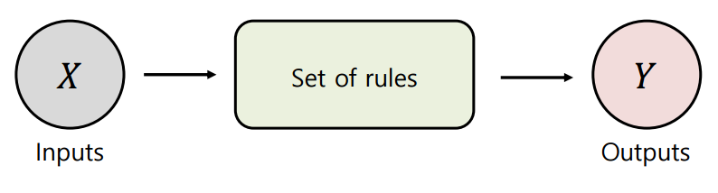

# 알고리즘

Created: 2023년 9월 8일 오후 4:49

---

### Week 1

## Part 1. Introduction to Algorithm

### Intro to Algorithm

- 알고리즘이 무엇인가?
    - 주어진 문제를 해결하기 위한 절차와 방법
    - 잘 정의되고 명확한 일련의 규칙(set of rules)
- 알고리즘은 입력을 출력으로 변환한다.
    
    
    
- 알고리즘의 예
    
    
    
- 알고리즘에 대한 연구
    - 원래 수학의 한 분야
    - 정확한 결과를 도출하기 위해 동일한 연산 과정을 사용하여
        
        특정 문제 유형의 모든 사례를 해결하는 방법을 찾는 것
        
- 알고리즘의 특성
    1. 입력이 지정되어야 함
    2. 출력이 지정된다
    3. 명확함
        1. 모든 명령은 모호하지 않아야 한다.
    4. 유효성
        1. 불필요한 명령을 포함시키지 말 것
    5. 유한성
        1. 종료 되어야 한다
    6. 독립성
        1. 모든 언어에서 동일하게 실행되어야 한다
        

## Part 2. Roles of the Algorithm

### 알고리즘의 역할

- 알고리즘은 모든 컴퓨팅 영역에서 사용된다
    - 프로그램
        - 컴퓨터가 이해할 수 있는 알고리즘 표현
        - 프로그래밍 언어로 작성된 알고리즘
        - 특정 컴퓨팅 작업에 대한 순차적인 명령
    - 프로그래밍
        - 프로그램 개발 과정
        - 코딩 + 분석과 구현 + 디버깅 + 컴파일링 등
    - 코딩
        - 알고리즘을 특정 프로그래밍 언어로 변환
- 알고리즘은 다양한 산업 분야에서 광범위하게 사용된다
    - 생산
        - 생산 프로세스 및 공급망 관리 최적화
        - 폐기물 및 결함 감소
    - 재무
        - 결정을 내린다
    - 건강관리
        - 질병 진단 지원
        - 치료 계획 최적화
    - 교통, 에너지, 보안 등
- 알고리즘은 컴퓨팅의 기본이며 중요한 역할을 한다
    - 데이터 처리
        - 정렬 및 검색 알고리즘과 같은 대용량의 데이터 분석,
    - 문제 해결
        - 수학적 문제, 최적화 문제 그리고 의사 결정 문제
    - 컴퓨터 그래픽스
        - 이미지 처리, 이미지 생성 등
    - AI
        - 머신 러닝, 자연어 처리, 컴퓨터 비전
    - 운영 체제
        - 프로세스 스케줄링, 메모리 관리 그리고 디스크 관리 등
- 알고리즘은 네트워킹 및 통신에서 중요한 역할을 한다
    - 라우팅
        - 데이터가 한 장치에서 다른 장치로 이동하는 데 가장 적합한 경로 결정
        - 최단 경로 알고리즘 및 로드 밸런싱 알고리즘
    - 오류수정
        - 주기적 중복 점검(CRC) 및 전방 오차 보정(FEC)
    - 데이터 압축
        - 전송되는 데이터 양 감소
        - IMT2000 3GPP - Huffman 부호화 및 run-length 부호화 알고리즘
    - 네트워크 보안
        - 암호화 및 인증 알고리즘
    - QOS(Quality of Service), 무선 네트워크, 네트워크 토폴로지 등

## Part 3. Computer Science and Algorithm

- 컴퓨터 과학과 알고리즘
    - 컴퓨터 과학 : 알고리즘과 연관된 학문 분야
        - 다양한 제약 조건 속에서 최적의 알고리즘을 만드는 방법
        - 일반적인 제약 조건
            - 공간 복잡도
            - 시간 복잡도
            
            
            
    - 컴퓨터 과학의 범위
        - 타 분야로부터 학문적 성과를 적용한 다양한 주제
        - 수학, 공학, 심리학, 경제, 언어
    - 컴퓨터 과학 기술의 영향
        - 다양한 작업에 사용되는 기술에 미치는 엄청난 영향
        - 사회적으로 중요한 영향
        

---

### Week 2

## Part 1. Preliminaries

### What is an algorithm?


- 문제란 무엇인가?
    - 목표를 달성하기 위해 처리 해야 하는 작업
- 파라미터란 무엇인가?
    - 문제에서 언급된 할당되지 않은 변수
- 인스턴스랑 무엇인가?
    - 파라미터에 실제로 할당된 값
- 알고리즘 문제
    - 수학적으로 엄격하게 정의된 문제
    - 반드시 해결책이 있어야한다. (유한성)
- 알고리즘 문제는 어떻게 해결해야 하나?
    - 인간의 경우
        - 숫자 및 연산자 사용
    - 컴퓨터의 경우
        - 컴퓨터 명령어의 집합 사용
- 문제 1 : 정수 n의 리스트 S를 순차적으로 정렬하라
    - 입력 : 𝑛 ∈ ℕ, 정렬되지 않은 S
    - 출력 : 정렬된 S
    
    ```c
    void sorting_algorithm(int 𝑛, int 𝑆[]){
    		int 𝑖, 𝑗; // indexes
    		for (𝑖 = 0; 𝑖 ≤ 𝑛; 𝑖++)
    		for (𝑗 = 𝑖+1; 𝑗 ≤ 𝑛; 𝑗++)
    		if (𝑆 𝑗 < 𝑆 𝑖 )
    		Swap 𝑆 𝑖 and 𝑆 𝑗
    }
    ```
    
- 문제 2 :
    
    𝑛 정수의 𝑆 목록에 정수 𝑥가 존재하는지 여부를 결정합니다. 만약 그것이
    
    존재한다면, 인덱스를 반환하고, 그렇지 않으면 -1을 반환합니다.
    
    - 입력 : 𝑛 ∈ ℕ, List 𝑆 ⊆ ℤ, 𝑥 ∈ ℤ
    - 출력 : Answer
    
    ```c
    void searching_algorithm(int 𝑛, const int 𝑆[], int 𝑥){
    	int 𝑖; // index
    	for (𝑖 = 0; 𝑖 < 𝑛; 𝑖++)
    		if (𝑆 𝑖 = 𝑥)
    			break;
    		if (𝑖 < 𝑛)
    			return 𝑖;
    		else
    			return -1;
    }
    ```
    
- 문제 3 : 𝑛 정수로 구성된 𝑆 리스트의 모든 원소의 합을 계산합니다.
    - 입력 : 𝑛 ∈ ℕ, List 𝑆 ⊆ ℤ
    - 출력 : sum
    
    ```c
    void sum_algorithm(int 𝑛, const int 𝑆[]){
    	int 𝑖, 𝑠𝑢𝑚 = 0; // index
    	for (𝑖 = 0; 𝑖 < 𝑛; 𝑖++)
    		𝑠𝑢𝑚 = 𝑠𝑢𝑚+𝑆 𝑖 ;
    	return 𝑠𝑢𝑚;
    }
    ```
    

## Part 2. Theoretical Analysis VS. Experimental Analysis

- 알고리즘 분석
    - 필요한 리소스 예측
    - 리소스 :
        - 계산 시간, 메모리, 통신 대역폭, 하드웨어 등
    - 주로 계산 시간을 측정한다
- 알고리즘을 분석해야 하는 이유는?
    - 주어진 문제에 대해 가장 효율적인 알고리즘을 식별하기 위해서
- 실험적 분석
    - 소스코드에 주어진 알고리즘 구현
    - 실제 환경에서 실행 및 경과 시간 측정
    - 예를 들어 C 프로그래밍 언어에서의 알고리즘의 경과 시간 : clock() 함수를 사용해 측정
    
    
    
- 실험적 분석의 한계
    - 알고리즘을 구현하려면 추가 시간과 노력이 필요
    - 다음과 같은 경우에는 고려할 수 없는 다양한 외부 요인이 있음
        - 경과 시간 측정
            - 코딩 스타일
            - 하드웨어 성능
            - 실행 시 컴퓨터의 상태
                
                등등
                
- 논리적 분석
    - 알고리즘에 의해 요구되는 리소스의 양을 이론적으로 묘사하는 방
    - 시간과 메모리 공간은 입력 크기 n 함수로 표시된다
    - 구현 X
    - 외부요인 X
    - 계산 복잡도라고 한다
- 이론적 분석에서 고려되는 기본 operations
    - 변수에 값 할당 (또는 대체)
    - 함수 호출
    - 함수의 결과 값 반환
    - 변수간 산술연산
    - 배열의 “Get” 및 “Set” 명령어
    - 컴퓨터에 정의된 명령어
        
        등등
        
- 상기 오퍼레이션의 정확한 경과시간을 알 수 없다
    - 하지만, 각 작업은 입력 크기와 무관하다
    - 이론적으로 이러한 작업들은 일정한 시간이 필요한 것으로 간주된다.
- 문제 1 : n 정수의 목록 S를 오름차순으로 정렬
    - 입력 : 𝑛 ℕ ∈, 정렬되지 않은 리스트 𝑆
    - 출력 : 정렬된 S
    
    
    
- 문제 2 : 𝑛 정수의 𝑆 목록에 정수 𝑥가 존재하는지 여부를 결정합니다. 
만약 그것이 존재하면, 인덱스를 반환하고, 그렇지 않으 -1을 반환합니다


- 문제 3


## Part 3. Computational Complexity

- 이론적 분석이 어떻게 수행되어야 하는가?
    - 공간 복잡도
        - 프로그램이 종료하기까지 필요한 공간의 양
        - ex) RAM 메모리 공간
    - 시간 복잡도
        - 프로그램이 종료되기까지 필요한 시간
        - ex) CPU 시간
- 공간 복잡도
    - 고정 요구 공간 : 𝑆p (𝐶)
        - 컴파일 단계에서 결정된 공간
        - 입력 크기 및 반복과 무관한 공간 요구 사
    - 가변 공간 요구랑 : *Sp (I)*
        - 인스턴스에 따라 필요한 공간
        - 런타임에 변경되는 공간
    
    
    
    
    
- 시간 복잡도
    - 𝑇 (𝑃) = Compile time + 𝑇p(𝑛)
    - 프로그램 단계
        - 의미론적 독립성을 가진 프로그램의 단위 ← 1 step
        - ex) a = 2, 𝑎 = 2 ∗ 𝑏 + 3 ∗ 𝑐Τ𝑑 − 𝑒 + 𝑓Τ𝑔Τ𝑎Τ𝑏Τ𝑐
            
            두 식 모두 1 step
            
        - 1 step 을 실행하는데 필요한 시간은 대상 인스턴스와 독립적이어야 한다
    - 알고리즘의 총 단계 수 계산
        - 전역 변수 ‘count’ 사용
            
            
            
        - 표 형식 사용
            
            
            

## Part 4. Asymptotic Notation

- 시간 복잡도
    - 필요한 단계 수만 나타낸다
    - 실제 경과 시간과 차이가 있음
- 계산 복잡도에 대한 점근적 분석
    - 여러 표기법 사용 Ω (오메가), Θ (세타), O (빅오)
- 손익 분기점
    - 주어진 프로그램의 시간 복잡도를 근사화하기
        
        
        
- 빅오 표기법
    - For ∀𝑛 ≥ 𝑛0,
        - 만약 양의 상수 𝑐 존재하고 𝑛0 such that 𝑓 (𝑛) ≤ 𝑐𝑔 (𝑛)를 만족시킨다면,
        𝑓(n) = (O 𝑔(𝑛)) (𝑛0은 손익 분기점)
            
            
            
    - f 입력 데이터의 알고리즘 n에 필요한 최대 경과 시간
    - 만약 𝑓(𝑛)의 빅오가 O(n^2) 이라면, 𝑓(𝑛) 최악의 경우에 𝑛^2 시간 경과한다
    - 빅오 표기법은 점근적 상한을 나타낸다
- 빅오 표기법의 규칙
    - 함수의 각 항의 계수는 생략할 수 있다
    - 만약 a > b일 때, n^a 와 n^b가 존재하면 n^a가 n^b를 도미네이트 해서 n^a만 고려
    - 2^n > n^2
    - n^2 > log n
- 오메가 표기법
    - For ∀𝑛 ≥ 𝑛0,
        - 만약 양의 상수 𝑐 존재하고 𝑛0 such that 𝑓 (𝑛) ≥ 𝑐𝑔 (𝑛)를 만족시킨다면,
        𝑓(n) = (Ω 𝑔(𝑛)) (𝑛0은 손익 분기점)
            
            
            
    - f 입력 데이터의 알고리즘 n에 필요한 최소 경과 시간
    - 만약 𝑓(𝑛)의 오메가가 Ω(n^2) 이라면, 𝑓(𝑛) 최고의 경우에 𝑛^2 시간 경과한다
    - 오메가 표기법은 점근적 하한선을 나타냅니다
- 세타 표기법
    - For ∀𝑛 ≥ 𝑛0,
        - 만약 양의 상수 𝑐1, c2가 존재하고 𝑛0 such that c1 g(n) ≤ 𝑓 (𝑛) ≤ 𝑐2 𝑔 (𝑛)를 만족시킨다면, 𝑓(n) = (Θ 𝑔(𝑛)) (𝑛0은 손익 분기점)
            
            
            
        - f 입력 데이터의 알고리즘 𝑛에 필요한 평균 경과 시간
        - 만약 𝑓(𝑛)의 세타가 Θ(n^2) 이라면, 𝑓(𝑛) 평균적인 경우에 𝑛^2 시간 경과한다
- 점근적 표기법을 이용한 알고리즘 분석
    - 두 행렬의 덧셈
        
        
        
- 실제 복잡도
    - 일반적인 복잡도의 가치
    - 컴퓨터가 초당 10개의 명령을 수행한다고 가정한다
    - 만약 n=32 이면, 복잡도가 O(2^n)인 알고리즘이  완성되는 13.6년이 걸린다
        
        
        
        
        

---

### Week 3/4

## Part. 1 Performance Evaluation

- 알고리즘의 성능은 무엇인가?
    - 작업의 목표와 얼마나 일치하는지 수치화
    - 주요 성능:
        - 정확도
        - 러닝 타임
    - 각 성능은 작업의 목적에 따라 다른 중요성을 가진다
        - 빅 데이터 시스템 : 데이터 처리 시간
        - 실시간 스트리밍 서비스 : querying time, data throughput
        - 시스템 추천 : mean average precision
        - 기상예보 시스템 : 정확도, 재현율 등
- 러닝 타임
    - 각 단위 작업별 경과 시간 평가
    - 함수를 사용하여 현재 시간 가져오기
    - ex) C언어 clock() 함
- 작업 수
    - 단위 작업 실행 수 평가
    - 러닝 타임은 각 작동마다 조금씩 변경될 수 있음
    - 실행시간과 동시에 사용해서는 안된다
        - 카운트 작업이 실행 시간에 포함되기 때문
- 데이터 처리량
    - 초당 데이터 처리 또는 연산 속도에 해당한다
        - TPS, FPS, FLOPS, etc
    - 주로 실시간 시스템에 활용
        - 비디오 스트리밍, 은행 거래, 주식 시장 등
- Confusion matrix
    - 다음과 같은 알고리즘의 정확성을 평가하기 위한 1차 측정 기준
    - 지면 진리도(GT)와 예측 결과비교하기 위한 행렬
        - GT: 사실로 알려진 정보
        
        
        
    - 정확도
        - 총 작업 중 예측 값이 올바른 비율
            
            
            
    - 정밀도 (Precision)
        - 예측된 positives를 제외한 실제 positives의 비율
            
            
            
    - 재현율 (Recall)
        - 실제 positives에서 예측된 positives의 비율
            
            
            
    - F1-Score
        - 정밀도 및 재현율의 조화평균
            
            
            
    - 정밀도와 재현율 비교
        - 정밀도 : 선택한 개체 중 올바른 개체
            - 알고리즘의 올바른 것으로 잘못 판단
        - 재현율 : 선택해야 할 개체 중 실제로 선택한 개체 수
            - 알고리즘이 잘못된 것으로 판단
    - F1-Score가 쓰이는 이유 : F1-Score는 데이터가 불균형할 때 쓰인다
        
        
        
- Mean absolute error (MAE)
    - 실제 값과 예측 값의 평균 차이
    
    
    
- 평균 제곱 오차 (MSE)
    - 실제 값과 예측 값 사이의 평균 제곱 차이
    
    
    
    - regression 작업에서도 사용된다
- MAE vs MSE
    - MAE는 이상치에 상대적으로 덜 민감하다
    - MSE는 MAE에 비해 전역 최적점으로 수렴하기 더 가능하다
- 글로벌 최적 솔루션
    - 전체 솔루션 집합 내 최고의 솔루션
- 로컬 최적 솔루션
    - 특정 범위 또는 지역 내에서 최상의 솔루션 제공
        
        
        

## Part. 2 Comparison of algorithms

- 이론적 분석
    1. 각 알고리즘에 대한 기본 연산의 수를 입력 크기의 함수로 표현
    2. 빅오 표기법 추정된 함수 표현
    3. 빅오 표기법으로 표현된 두 함수 비교
    
    ⇒ 더 느리게 성장하는 함수로 표현할 수 있는 알고리즘이 이론적으로 더 나은 알고리즘 
    
- 실험적 분석
    - 공정한 비교
        - 알고리즘의 성능을 측정하고 비교한다
        - 실험적 재현성과 복제성을 보장한다
        - 실험 설정에 따라 결과가 변경되는 경우가 많음
    - 실험적 재현성 및 복제성
        - 여러번 반복 했을 때 일관된 결과를 얻을 수 있는 실험 능력
        - Issues
            - 데이터 전처리
            - 하이퍼 파라미터 선택
            - 실험 환경
            - 등…
            - 

## Part. 3 Algorithm analysis using Big-Oh Notation

-