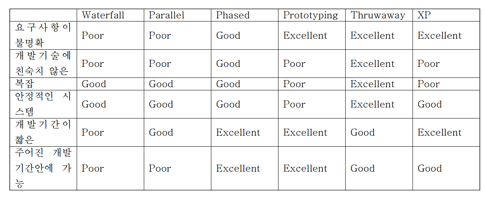

# 객체 지향 설계

- Analysis and Design of Software Systems
    
    What is software development?
    
    - 요구사항 == Final System
    - Software development는 연속적인 액티비티 모델링
    
    What is modeling?
    
    - d
    
    Development Process
    
    - SDLC(Software Development Life Cycle)
        
        요구사항
        
        > Planning
        > 
        
        > Analysis
        > 
        
        > Design
        > 
        
        > Implementation
        > 
        
        Final System
        
    
    Activities in Each Phase (각 단계별 활동)
    
    - Planning Phase (계획 단계)
    - Analysis Phase (분석 단계)
    - Design Phase (디자인 단계)
    - Implementation Phase (구현 단계)
    
    Software Development Process
    
    - Software development는 연속적인 액티비티 모델링 → 이걸 어떻게 수행할 것 인가?
    
    Software Process Models
    
    - Structured Development (구조적 방법론)
        - 한 단계에서 다음 단계로 체계적으로 이동 (한 단계씩)
        - 일반적으로 한 단계가 끝나면, 다음 단계 시작
        - 대표적 모델
            1. Waterfall model
            2. Parallel development model
    - Rapid Application Development (RAD)
        - Case tools 사용
        - JAD sessions : 프로토타입을 통한 개발
        - 대표적 모델
            - Incremental development model (Phased development)
            - Prototyping-based model
                - Throwaway prototyping
  

### Analysis and Design of Software Systems

> What is Software Development
> 

소프트웨어 개발은 연속적인 모델링 활동이다

> What is Modeling
> 
1. Multiple Views
2. Representation Abstraction of features
3. Recognition

> SDLC
> 
1. Planning
2. Analysis
3. Design
4. Implementation

> Software Process Models
> 
- Structured Development
    - 순차적, 체계적
    - 대표 모델
        - Waterfall Model 폭포수 모델 : 변경이 발생할 수 있다. 요구사항 명확해야
        - Parallel development model 병렬 개발 모델
            - 팀간의 인터페이스가 필요
            - 통합과정이 필요하다
            - 문제 발생시 문제 발생 원인을 추적하는 과정에서 overhead 발생
            - 서로 의존적이지 않은 모듈에 대해서만 가능하다
- Rapid Application Development (RAD)
    - 사용 이유
        1. 사용자에게 Feedback을 받기 위해서
        2. 시장 점유율을 확보하기 위해서
    - JAD sessions을 가진다 : joint app. development
    - 대표 모델
        - Incremental development model (Phased development) : 분석, 설계의 양이 많다.
        - Prototyping
            - System Prototyping : 사용자가 만족시 빠르게 개발
            - Throwaway prototyping(design prototype) : 요구사항 변경 금방 적용가능
- Agile development (애자일 개발론)
    - 여전히 인기
    - 단순, 반복적 개발론 (모듈을 반복적으로 개발)
    - 대표 모델
        - eXxtreme Programming approach (XP) : 문서 작성 X, 규칙(실천사항) 기반으로 반복적 개발
        - Scrum approach
            - 요구사항 관리자, The Team, Scrum Master
            - 요구사항 받음 → 백로그 생성 → 백로그 기반 단기 일정 수립(스프린트 플래닝 미팅) → Task 단위로 나눔 → 1~4주 정도 Sprint 개발 → 24시간 Daily Standing 미팅 → Sprint Review → Finsish Work → Sprint Retrospective (개선점, 규칙준수 여부 회고)
- DevOps

---

### Object-Oriented Analysis & Design

> OOAD : The Origins
> 
- 1960년대와 1970년대
    - Simula, 1967년 Ole-Johan Dahl과 Kristen Nygaard 제작
    - 클래스, 객체, 상속, 다형성의 개념.
- 1972년
    - Alan Kay의 스몰토크(Xerox PARC)
    - 추가로 최초의 순수 OO 언어 동적 타이핑, 가비지 수집 및 그래픽 사용자 인터
    페이스.
- 1980년대 중반
    - OO 분석 및 설계: G. Booch(UI Class 컨셉 제안), I. Jaconson(use case 기반 분석설계 기법 제시), J. Rumbaugh(객체지향 분석설계)
- 1994년
    - 세 명의 친구가 함께 UML 개발을 시작합니다.
    - 합리적인 통합 프로세스(UP)

> Basic Characteristics of Object-Orientation
> 

소프트웨어 시스템의 구조와 동작을 포착하는데 중점을 둔다

기본 특징

- 클래스와 객체
- 메서드와 메시지
- 캡슐화와 정보은닉 : Data와 Process 묶기 / 사용자에게 필요한 정보만 제공하고 나머지는 숨김
- 상속 : 하위 클래스에게 상위클래스가 attribute와 method를 상속
- 다형성과 다이나믹 바인딩 : 동일한 형태의 메시지에 대해 객체와 클래스따라 다르게 해석 / 실행 시 결정되는 동적인 데이터나 method

> UML
> 
- History of UML
    - 1994년에 처음 개발 시작
    - 1.0 1997년에 OMG가(Object management group) 채택
    - 1.4 2005년 까지 널리 사용되는 버전
    - 2005년 7월 4일 2.0버전
    - 2009년 2월 2.2 버전, 2011년 2.4.1버전
- UML Notation consists of
    - Structure Diagram
    - Behavior Diagram
    - Extension Mechanisms

3가지 관점의 다이어그램은 UML이 서포트하고있다

- Functional
- Structual
- Behavior

다이어그램

- 구조 다이어그램
    - Class 다이어그램 : 시스템에서 모델링된 클래스간의 관계
    - Deployment 다이어그램 : 시스템의 물리적 아키텍처를 보여줌. 물리적 구조에 배포되는 소프트웨어 구성 요소를 표시하는데도 사용할 수 있다.
    - Package 다이어그램 : 동일한 속성을 가진 UML 요소를 그룹화하여 더 높은 수준의 구성을 형성. 좀 더 추상화 : 대상의 요소를 생성하기 위해
    - Component 다이어그램 : 컴포넌트 간의 물리적 관계 설명
    - Object 다이어그램 : 시스템에서 모델링된 객체간의 관계 
    클래스의 인스턴스가 모델과 더 잘 소통할 때 사용된다
        
        클래스의 실례를들어 모델간의 의사소
        
    - Profile 다이어그램
- Behavior 다이어그램
    - Activity 다이어그램 : 클래스의 독립적인 비즈니스 workflow, 유즈 케이스의 액티비티 흐름, 혹은 메서드의 상세한 디자인을 설명한다. 작업의 흐름을 표현한다.
    - Use Case 다이어그램 : 시스템에 대한 비즈니스 요구사항을 포착하고 시스템과 환경 사이의 상호 작용을 설명한다. 사용자 입장에서 시스템의 행동
    - State Machine 다이어그램 : 
    동작 상태 머신 : 한 클래스의 동작을 검사한다. 
    프로토콜 상태 머신 : 클래스의 다양한 인터페이스간의 의존성을 설명한다.
    - Interaction 다이어그램
        - Sequence 다이어그램 : 유즈 케이스 내에서 객체의 동작을 모델링한다. 액티비티의 시간 중심 순서에 집중한다.
        - Interaction Overview 다이어그램 : 프로세스 제어 흐름 개요 설명
        - Communication 다이어그램 : 유즈 케이스 내에서 객체의 동작 모델링, 작업 개체간의 의사소통을 중점
        - Timing 다이어그램 : 객체 사이 상호작용과 시간따라 변하는 상태를 설명

> Extension Mechanisms
> 
- 스테레오 타입
    - UML의 의미를 확장하는 모델링 요소 타입
    - brackets << >> 로 표현
- Tagged Values
    - 베이스 요소에 새 속성 추가
- 제약사항
    - OCL을 사용하여 모델 사용 요소 제한
- 프로필
    - 스테레오타입, 태그된 값 및/또는 제약 조건을 사용하여 패키지로 확장된 그룹 모델 요소

> OOAD
> 
- 분석
    - 해결책을 정의하는 방법보다는 문제에 대한 조사를 강조합니다
    - 해결책 마련 보다는 분석위주
- 디자인(설계)
    - 시스템이 요구 사항을 충족하는 방법, 개념적 솔루션을 강조합니다.
- OOAD 분석
    - 객체를 찾고 정의한다
    - 시스템에 클래스가 무엇이 있고 필요한지를 식별한다
- OOAD 설계
    - 소프트웨어 객체 정의 및 요구사항 충족을 위해 협업(수행)하는 방법
- OOAD 접근법
    - Use-case 기반 접근방식
        - Use case는 시스템의 동작을 정의하는 기본 모델링 도구입니다.
    - 아키텍처 중심
    - Iterative and Increamental
        - 개발은 프로젝트 수명 전반에 걸쳐 지속적인 테스트와 개선을 거칩니다.
        - 반복적이고 점진적인 방법
    - The Unified Process (UP)
        - OOAD에 대한 다양한 UML 기술을 언제, 어떻게 사용할 것인지를 계획하는
        개발 프로세스
        - 사용 사례 중심, 아키텍처 중심, 반복 및 증분 접근 방식을 지원합니다.

> Benefits of the Object Approach
> 
- 클래스, 객체, 메서드 그리고 메시지
    - Support
        - 현실적인 방법으로 비즈니스를 생각할 수 있게 해줌
        - 데이터와 프로세스간의 높은 응집력
    - Lead to
        - 사용자와 분석/개발자간의 커뮤니케이션 향상
        - 재사용가능한 객체
        - 응집력이 높은 시스템으로부터 받는 이득 ⇒ 기능을 쉽게 이해
- 캡슐화와 정보은닉
    - Support
        - 느슨하게 묶인 유닛
    - Lead to
        - 재사용 가능한 객체
        - 변화에 적게 영항을 받는다
        - 느슨하게 묶인 시스템으로부터 받는 이득
- 상속
    - Support
        - 클래스를 템플릿으로 사용하여 중복하여 정의할 필요가 없다
    - Lead to
        - 중복성 낮춤
        - 새로운 클래스를 생성하기 빠르다
        - 예외처리가 쉽다
        - 표준적이고 일관적이다
- 다형성과 다이나믹 바인딩
    - Support
        - 최소의 메시지
    - Lead to
        - 이벤트의 간단한 프로그래밍
        - 객체의 재배치와 교체와 변경이 쉽다
        - 변경으로 인한 영향이 적다
- use case 기반과 use case
    - Support
        - 유저와 분석가가 유저가 어떻게 싱글 액티비티를 수행하는 시스템과 어떻게 상호작용을 하는지에 중점을 둘 수 있게 해준다
    - Lead to
        - 유저의 요구사항 수집과 이해 용이
        - 유저와 분석가 사이에서 교류 용이
- 아키텍처 중심과 기능, static 그리고 다이나믹 뷰
    - Support
        - 다양한 관점으로 보는 시스템의 진화
    - Lead to
        - 유저가 필요한 것을 더 이해하기 쉽고 모델링하기 편리
        - 더욱 더 완벽해지는 시스템의 묘사
- 반복적이고 점진적인 개발
    - Support
        - 계속적인 테스트와 시스템의 개선
    - Lead to
        - 유저의 실제 요구 충족
        - 시스템의 질 향상

> Quick Tour OOAD by Example
> 

---

### Requirements Determination

> What is a Requirements
> 

시스템이 해야만 하는 것 가져야만하는 특성을 기술한 것

분석과 설계가 진행됨에 따라 변할 수 있다.

기능적과 비기능적

- 기능적 요구사항
    - 직접 시스템이 수행해야하는 과정에 관계가 있다
    - 사용자의 요구사항을 검토하고, 이 요구사항을 해결하기 위해 시스템이 수행해야 할 기능
- 비기능적 요구사항
    - 성능 같은 시스템이 맡아야하는 행동의 특성
    - 시스템과 관련되는 제약사항, 수행시의 성능에 대한 요구
- 모든 요구사항은
    1. 유일한 식별자를 가져야한다.
    2. 행위, 주체를 명확하게
    3. 단문으로 기술
    4. 모듈화 (Optional)
- Requirement Scrab : 요구사항의 사소한 것 까지 긁어내는 것, 요구사항 별로 중요도, 우선순위 정보

> Requirement Gathering Techniques
> 

사용자 요구사항과 시스템 요구사항 사이의 틈을 연결해주는 것

- 참여할 사람을 찾고, 정보 수집 및 통합
- Techniques
    - Interviews : 간결하게 진행
    - JAD (Joint Application Development)
        - 연합으로 모여서 요구사항을 수집하는 것, 너무 구체적이거나 모호하지 않게
        - 진행자와 서기
        - 진행자활동이 중
    - Questionnaire 설문지
    - Document Analysis 문서 분석
        - 존재하는 “as-is” 한 시스템에 대한 정보를 제공한다
    - Observation 관찰
        - 사용자/관리자는 자신이 하는 것을 기억못하는 경우가 있으니 제3의 관찰
        - 항상 하는 일을 기억하지 못하는 것을 방지
        - 누군가 보고 있으면 더 잘한다
    - SNS
- 요구사항 분석의 기초적인 과정
    - as-is: (현재의) 시스템을 이해하는 것
    - improve: 개선해야 할 사항을 확인하는 것
    - To-Be: (미래의) 시스템을 위해 요구사항을 발전시키는 것

> Contents of Deliverables 산출할 수 있는 것들
> 
- 요구사항 정의로부터의 내용
    - 기능적인 요구사항
    - 비기능적인 요구사항

---

### Activity Diagram

> BPM with Activity Diagram
> 
- 여러 부서에 거쳐 비즈니스 프로세스를 서포트하는 다양한 액티비티
    - 비즈니스 프로세스: 비즈니스 시스템이 어떻게 작동하는지 설명합니다.
    - 수행되는 프로세스나 활동, 그리고 그 사이에서 객체(데이터)가 어떻게 이동하는지
    - 현재 시스템(as-is)과 새로운 시스템(to-be)이 모두 포함됩니다.
    - 전산화 여부를 고려하지 않음
- 액티비티 다이어그램
    - 비즈니스 프로세스의 상위 수준 동작 모델
    - 논리 모델, 문제 영역 모델
    - 정교한 데이터 흐름 다이어그램
    - 병렬 동시 활동 및 복잡한 프로세스를 해결합니다.

> Activity Diagram
> 

소프트웨어 또는 하드웨어 시스템 동작을 지정하는 데 유용합니다.
데이터 흐름 모델 기반 ‒  정보 시스템 내에서 데이터가 어떻게 이동하는지에 대한 그래픽 표현(방향성 포함)

> Elements of Acitivity Diagram
> 
1. An Action
    1. 간단하고 분해 할 수 없는 행동 조각이다.
    2. 그것의 이름을 붙인다.
    3. 액티비티에서 실행 가능한 기능의 기본 단위
2. An Activity
    1. Action 들의 집합을 표현하기 위해 사용한다.
    2. 이름을 붙인다.
    3. 매개변수를 사용하여 데이터를 수신하고 호출자에게 제공합니다.
3. An object node
    1. Object 흐름의 집합과 연결된 Object를 표현하기위해 사용한다.
    2. 클래스 이름을 붙인다.
4. A Control Flow
    1. 실행의 순서를 나타낸다
5. An Object Flow
    1. 하나의 activity(or action)에서 다른 activity로 가는 object의 흐름을 보여준다
6. An Initial Node
    1. actions 혹은 activities의 집합의 시작을 표현한다.
    2. 초기 노드에 하나 이상의 나가는 간선이 있는 경우
        1. 이 엣지 중 하나만 제어를 받습니다. (2개중에 하나만)
7. A Final-Activity Node
    1. 모든 제어 흐름과 object 흐름 을 멈출 때 사용한다.
8. A Final-Flow Node
    1. 특별한 제어 흐름이나 object 흐름을 종료할 때 사용한다.
9. A Decision Node
    1. 제어 흐름이나 object 흐름에서 한 곳으로만 가는 test condition을 표현할 때 사용한다.
10. A Merge Node
    1. 분기를 통합 할 때 사용한다.
    2. 흐름의 동기화가 없다 ⇒ 먼저 온 놈 먼저 먼저간다. 합쳐지는 의미 X
11. A Fork Node
    1. 병렬적으로 혹은 동시에 activities의 흐름이 쪼개져서 행동할 때 사용한다.
    2. Process를 하나 더 만든다.
12. A Join Node
    1. 병렬적으로 혹은 동시에 activities의 흐름이 다시 합쳐질 때 사용한다.
    2. 두 결과가 다 와서 동기화되어야 다음 액션 진행
13. A Swimlane
    1. activity diagram 상의 상태들을 group으로 분할할 때 유용한 경우
    2. 각각의 swimlane 은 diagram상에서 고유한 이름을 가지며, 궁극적으로 하나이상의 class로 구현 (역할로 구분한다고 생각)
14. Pins
    1. Input/Output 핀 존재
    2. 어떤 특정한 객체의 유형 데이터가 머무는 장소
    3. 제어 흐름의 명확성을 위해
15. Activity edges
    1. 제어 흐름 엣지 : 제어 토큰을 전달하여 이전 노드가 완료된 후 활동 노드를 시작하는 에지입니다.
    2. 객체 흐름 엣지 : 객체 또는 데이터 토큰을 전달하여 객체 노드로 또는 객체 노드에서 값의 흐름을 모델링합니다.
16. Signal
    1. 비동기 자극이다 
17. Interruptible Region 인터럽트 가능 영역
    1. 내부 활동을 중단하라는 신호를 받은 경우 인터럽트 가능 영역, 해당 영역의 모든 동작이 종료됩니다.

> Creating Acitivity Diagram
> 
1. activity diagram은 어떤 종류의 프로세스에서라도 사용 할 수 있다. 
그리고 그 때 modeled 할 activity의 범위나 전후관계를 정해야 한다. 
범위를 결정할 때 적절한 title을 diagram에 주어야 한다.
2. activities 사이에 일어나는 activities, control flows, object flows를
반드시 확인해야 한다.
3. 프로세스의 어떤 부분이 모델 될 때 어떤 결정을 해야 하는지 확인
해야 한다.
4. 프로세스를 병렬차원에서 식별하려 해야한다.
5. activity diagram을 그린다.

- 읽기 쉽게 해야 한다.(겹치는 선 최소화)
- 다이어그램에서 activities는 왼쪽에서 오른쪽 혹은 위에서 아래 순서로
설계해야한다.
1. Swimlanes
    1. 이해를 단순하게 하는데 사용한다.
    2. 다른 swimlane과 교차하는 흐름 숫자를 최소화한다.
    3. 수평으로 혹은 수직으로 입력 흐름이 없으면 출력흐름도 없다.

---

### Functional Modeling(Use Case Diagram)

> Use Case & Use Case Diagram
> 
- 시스템 함수의 간단한 서술은 새의 눈으로 봐야 한다.
- 시스템 사용자에 의해 수행되는 activities를 설명한다.
1. Logical models
    1. 액티비티가 구현되는 방법을 지정하지 않고 시스템의 액티비티를 설명합니다
2. Describe basic functions of the system
    1. 사용자가 무엇을 할 수 있는가?
    2. 시스템은 어떻게 응답할 것인가?

> How are use cases created?
> 

모든 UML diagramming 기술을 위한 중요한 지침서

- 두 단계
    - text기반의 case description을 써라
    - description을 다이어그램으로 바꾸어라
- 확인된 요구사항 정의서와 비즈니스 프로세스의 activity diagram을 기반으로 해서 만들어라
- 하나의 설명은 단 하나의 함수 그러나 다양한 경로를 가져야한다.
- 그들의 만족을 위해서 사용자와 함께 개발해야한다.

계층적 다이어그램으로 그릴 수 있다.

> Types of Use Cases
> 
1. Overview VS. Detail Use case
    1. 요구서의 개관은 높은 레벨에 있다.
    2. Use case는 중요한 business process를 설명한다.
    3. 시스템 요구서 이해의 process을 빠르게 만들 수 있다.
    4. 정보를 포함한다.
        1. use case name, ID number, primary actor, type, brief description
    5. 상세한 Use case로 변환한다.
2. Essential Vs. Real Use case
    1. 최소의 중요한 이슈를 설명한다., 요구 기능을 이해하기 위해서 필요하다.
    2. 독립적인 이행
    3. Real Use Case로 확장한다.
        1. 시스템이 이행될 때 어떻게 사용하는지의 상세한 설명서

> Guidelines for Use Case Descriptions
> 
1. 각 단계를 “SVDPI” 형식(즉, 완전한 문장, 주어 동사 목적어 형식)
2. 단계의 최초 작성자가 누구인지 명확히 확인하십시오.
3. 객적인 관찰자의 관점에서 단계를 작성하세요.
4. 동일한 추상화 수준에서 각 단계를 작성합니다.
5. 각 단계의 구성이 잘 보이게 Use case를 확실히 해야한다
6. KISS 원칙을 자유롭게 적용(최대한 간단 명료하게 제공하라..)
7. 반복해야 하는 부분은 반드시 반복해야 한다고 써라.
- Your Turn
당신은 요구서를 만들기 위해 여러 자료를 모아 왔는데 우리가 Use case를
만들기 위해서 더 필요한 것은 어떤 것이 있는가?
    - As-Is(현재 상태, ~이다): observation ->현재상태 요구사항을 얻기위해서
    - To-be(미래) : 인터뷰, JAD -> 앞으로의 요구사항을 얻기위해

> Use Case Diagram
> 
- 1개의 그림에서 모델화되고 있는 시스템의 일부를 위해 모든 사용 경우를 요약한다.
- 매우 높은 수준에서 시스템의 기능성을 해석해라
- 시스템을 위한 요구서를 정의하고 수집 할 때 SDLC(Software Development Life Cycle) 기반 하에 잡는다.
- 시스템의 중요한 기능과 다른 종류의 시스템과 상호 작용하는 사용자를 그린다.
- Components of Use Case Diagram(유즈케이스다이어그램의 요소들)
    - Actor
    - Use case
    - Subject Boundary(System Boundary)
    - Relationship
    - System main

> Use-case 다이어그램의 문법
> 
1. Actor
    - 외부에서 subject로 부터 이익을 끌어내는 사람이나 시스템
    - 사람이 아닌 actor
    - 역할을 표시한다.
    - 상세화/수퍼class 관계를 사용하는 다른 actor와 관계 가질 수 있다.그럴 땐 머리가 하얀 화살표로 표시한다.
    - subject boundary 바깥 공간에 위치한다.
2. Use Case
    - 시스템 기능의 중요한 한 부분을 표현한다.
    - 다른 Use case로 확장할 수 있다.
    - 다른 Use case를 포함할 수 있다.
    - system boundary 안에 위치한다.
    - 동사-명사로 이름 붙인다.
    - 이름은 행위적으로, 무슨 일을 하는지 나타나게
3. Subject Boundary
    - subject의 안이나 위에 이름을 포함해야한다.
    - subject의 scope를 표현해야한다. a system 혹은 독립적인 비즈니스 프로세스
4. Association Relationship
    - 서로 영향을 주는 actor와 use case를 연결한다.
5. Include Relationship
    - 하나의 Use case와 기능적으로 포함관계에 있는 Use case를 상호 연결한다.
    - base Use case에서 included Use case로 화살표를 그린다.
6. Extend Relationship
    - 추가적인 행동을 포함하는 Use case와의 확장 관계
    - extension use case에서 base Use case로 화살표를 그린다.
7. Generalization Relationship
    1. 상세한 Use case 와 좀 더 일반화된 Use case와의 관계
    2. base Use case에서 specialized Use case로 화살표를 그린다.

> Writing Use Cases
> 
1. Use Case
    - 시스템의 기능을 설명한다. (사용자의 기능적 요구사항 관점)
    - actor 와 system의 dialog model이다.
    - 시스템의 배경과 상세한 요구서의 model이다.
2. Purpose of Use Case
    - 시스템의 기능 요구 문서
    - 변화(진화)하는 시스템 테스트를 위한 기초
3. Major steps in writing Use Case
    - 중요한 Use cases를 정의한다.
    - 중요한 Use cases를 확장한다.
    - 중요한 Use cases를 확증한다.
    - Use case diagram을 만든다.

> Steps in Writing Use Case
> 
1. 중요한 Use cases를 정의한다.
    1. activity diagram을 본다.
    2. subject's boundaries를 찾는다.
    3. 기초적인 actors와 그들의 목적을 확인한다.
    4. 중요한 Use case를 확인하고 개관을 적는다.
    5. 현재의 Use case를 조심히 확인하고 필요하면 개정한다.
2. 중요한 Use cases를 확장한다.
    1. 확장 할 Use case를 선택한다.
    2. 선택된 Use case의 details를 채우기 시작한다.
    3. 그 Use case 이벤트의 일반적 흐름을 그린다(적는다)
    4. 만약 이벤트의 일반적 흐름이 너무 복잡하거나 길면 subflows로 분해한다.
    5. 가능한 대체 혹은 예외 흐름을 리스트로 만들어라
    6. 각각의 대체 혹은 예외 흐름을 일 때 actor와(혹은) system이 어떻게 재행동 해야 하는지 리스트로 만들어라.
3. 중요한 Use cases를 확증한다.
    1. 현재의 Use cases 집합을 조심히 살펴보고 필요하면 개정하라
    2. 위에서 다시 시작하라.
4. Use case diagram을 만든다.
    1. Subject boundary를 그린다.
    2. 다이어그램에 Use cases를 놓는다.
    3. 다이어그램에 actors를 놓는다.
    4. 관계를 그린다.

> Identifying the Major Use Cases(중요한 유즈케이스 확인)
> 
1. Review the activity diagram
    - 기초가 되는 비즈니스 프로세스의 완비된 개관을 이해한다.
2. system's boundaries(or subject boundary)를 확인한다.
    - system의 scope를 확인한다.
3. 기초 actors와 그들의 목적을 list한다.
    - actor는 개개의 사용자가 아니라 역할이다
4. 중요한 Use cases의 개관을 확인하고 쓴다.
    1. 중요한 Use case에 초점을 맞춘다. 그 이유는 사용자의 인식과 비즈니스 프로세스 때문이다.
    2. includes
        1. Use case name, ID, Importance level, Primary actor, Use case type,
        2. Stakeholder(관련된 사람,시스템),Brief description(간단한 설명)
5. Use cases를 조심히 살펴본다.
    1. 쪼개거나 합쳐야 할 Use cases가 있는지 살펴본다.
    2. 일반적으로 각 시스템 안의 Use cses는 3개에서 9개 사이가 적당하다.
6. 확장 할 Use case를 선택한다.
    - Use Case의 우선순위를 사용한다.
7. 선택된 Use case의 details를 채우기 시작한다.
    - 선택된 Use case의 세부 사항을 채운다.
8. 그 Use case 이벤트의 일반적 흐름을 그린다(적는다)
    - 비지니스 프로세스가 Use case를 완료하기 위해 하는 것에 대한 초점을 맞춘다.
    - 프로세스가 수행되면서 SVDPI 중 어디에 속하는지 그 단계를 안다.
9. 만약 이벤트의 일반적 흐름이 너무 복잡하거나 길면 subflows로 분해한다.
    - 너무 길거나 복잡하게 하지 않는다.
    - 일반적으로 7단계에서 12단계 사이를 넘지 않는ㄷ.
10. 가능한 대체 혹은 예외 흐름을 리스트로 만들어라
    - 옵션이거나 예외적인 행동을 표현하라.
11. 각각의 대체 혹은 예외 흐름을 일 때 actor와(혹은) system이 어떻게 재행동 해야 하는지 리스트로 만들어라.
    - 대체 혹은 예외적인 행동을 설명한다.
12. 현재의 Use cases 집합을 조심히 살펴보고 필요하면 개정하라
    - 사용자와 Use cases를 각 단계가 정확한지 알기 위해 재조사해라.(Review)
    - include,extend, or generalization relationship 와 Use cases를 고려한다.
13. 모든 사용 경우가 정의될 때까지 단계를 재조사해라.
    - 충분한 수의 Use Case가 구조적 모델을 위한 후보 클래스를 확인하는 문서를 가지게 되었다.

> Human Actor
> 
- 특정한 사람이나 특정한 장치를 의미하지 않는다.
    - 실제로, 많은 사람은 하나의 actor로 표현 할 수 있다.
        - 많은 사람은 같은 역할을 갖는다.
    - 실제로, 한 사람은 많은 actors로 표현 될 수 있다.
        - 많은 역할은 한 사람과 관계될 수 있다.

> Identifying the Actor
> 
- Questions to identify the actor:
    - 누가 시스템의 메인 기능을 사용하는가?
    - 개발하는 시스템과 상호 연관된 시스템은 무엇인가?
    - 누가 그들의 작업을 하기 위해서 시스템의 지원을 필요로 하는가?
    - 시스템에게 이벤트를 발생시키는 사람(물건) 무엇인가?
    - 시스템의 출력 이벤트에 응답하는 사람(물건)은 무엇인가?
    - 시스템으로부터 정보를 요구하는 사람은 무엇인가?/시스템에 정보를 제공하는 누구인
    가?
    - 정보를 보고하기 위해서 어떤 interface가 필요한가?
    - 시스템 내에 미리 정의된 actors가 있는가?
    - 시스템에서 누가 install하는 조작자,누가 유지하는 조작자, 누가 retiring 하는 조작자
    인가?
    
    > Use case diagram을 만든다.
    > 
    1. Subject boundary를 그린다.
    2. 다이어그램에 Use cases를 놓는다.
    3. 다이어그램에 actors를 놓는다.
    4. 관계를 그린다.
    
    > Three types of relationships
    > 
    - Generalization: 자식 Use Case와 부모 Use case 관계
    - Extend
        - 추가적인 옵션의 집합을 위해
        - 완벽하지는 않지만 기능적인 Use Case를 전개하기 위해
    - Include
        - 다른 Use case로 정의되는 것을 포함한다.(필수적)
        - base Use cased의 행동에 추가시킬 수 있다.

> Summary
> 
- use case 설명은 추가 분석 및 설계의 기초입니다. (작성 규칙이 있다.)
- 사용 사례 다이어그램은 시스템의 기능적 주요 내용에 대한 그래픽 개요를 제공합니다.
- 유스 케이스 다이어그램의 목적은 무엇입니까?
    1. 텍스트 요구사항보다 더 직관적인 전체 View
    2. 역할 별로 기능 파악에 용이하다
    3. 액터와 의사소통이 쉽게 이루어진다
- 액티비티 ↔ 유즈케이스 다이어그램
    - 액티비티 다이어그램 : 프로세스, 제어흐름(분기)를 가진다.
    - 유즈케이스 : 제어흐름 없음

---

### Structural Modeling

> Before 구조적 모델링
> 
1. Use Case Diagram 구현
    1. 각각의 Use-case를 좀 더 상세화 하기위해
    2. Use-case를 시스템에 연결 시키기 위해
2. Sequence Diagram 구현
    1. Use-case마다 sequence diagram
    2. 객체와 특징 명령들을 확인하는데 도움을 준다

> Introduction
> 
1. Functional model
    1. 업무체계가 어떻게 동작하는지를 나타내기 위해
2. Structural model
    1. 비지니스 시스템에 의해 사용되고 만들어진 객체들을 표현하는 것
3. Structural model is evolving over time(시간이 가면서 진화한다)
    - Analysis phase 분석 단계
        - 개념적 모델
        - 객체의 논리적인 구조에만 관심
    - Design phase 설계 단계
        - 디자인 모델
        - 객체가 데이터베이스와 파일안에서 어떻게 구성되어 질 것인가를 반영한다
4. 시스템에 사용된 데이터의 구조는 CRC카드, class diagrams, object diagrams로 대표된다

> 구조적 모델링의 목적
> 
- 실제 세상과 소프트웨어 사이의 차이를 줄이기 위해서
- 분석가와 유저를 위한 용어 생성
- 프로그램 영역의 중요한 개념을 표현하기 위해서
- 결국 클래스 다이어그램을 그리기 위해서

> Class, Attributes, Operations
> 
1. Classes
    1. 업무 영역에서 인스턴스와 객체를 만들기 위한 템플릿
        1. Concrete: 업무 영역에 대한 묘사(구체화된 클래스) ex) Person 
        2. Abstract: 유용한 추상화의 정의(구체화되지않은 추상) ex) Customer, Manager
    2. 대표적인 예
        1. Application domain class, 
        2. User interface class, 
        3. Data structure class, 
        4. File structure class,
        5. Operating environment class, 
        6. Document classes....
2. Attributes(속성)
    1. 클래스를 기술하기 위한 정보의 단위
    2. 중요하게 여겨지는 특징을 포함해야 한다 (행위 실행을 위해 필요한 클래스의 속성)
    3. “머리색”이라는 특징은 “사람”에 포함되는가?
3. Operations
    1. 인스턴스/객체가 수행할 수 있는 작업
    2. 클래스의 행위함수
    3. 문제 중심적인 행위들에만 초점
4. Considerations(고려사항)
    1. 특정한 클래스와 특징, 명령들을 만드는 것을 피해야 한다

> Relationships
> 
- 3 basic relationship: generalization(일반화), aggregation(집합), association(연관)
1. 일반화(상속가능)
    1. 속성의 상속이 가능하고 다른 클래스에서의 작업이 가능하다
    2. 슈퍼클래스와 서브클래스는 kind of관계
    3. 일반화 계층
    4. 상세화
    5. ex) 사람 클래스와 하위의 의사, 환자등 파생클래스간의 관계
2. Aggregation
    1. 합성관계
    2. a-part-of 혹은 has-parts 관계
    3. 뒷면: 해체
    4. ex) 자동차 클래스를 구성하는 문, 창문, 엔진등의 부속품 관계
3. Association
    1. 클래스 사이에서의 기타등등 관계
    2. kind of도 has-part도 아닌 기타 등등 관계
    3. ex) 환자와 약속간의 관계

> CRC Card (Class의 이력서)
> 

Class-Responsibility-Collaboration Card(클래스-책임-협력 카드)

- Used to
    - 하나의 클래스가 기능적 책임과 다른것과 협력
    - class와 관련된 모든 정보를 확보하는데 사용
- Responsibilities of a class
    - 책임 알기
        - 클래스가 어떤 속성의 값과 관계를 가지고 있는지 알기
    - 책임 실행
        - 클래스의 인스턴스는 이 명령으로 실행이 가능하다
- Collaboration
    - 객체는 요구를 들어주기 위해 협력해서 일한다
    - 클래스들은 유즈케이스에 포함된다
    - 클라이언트, 서버, 콘택트에서(행동의 이름)

> Class Diagram
> 
- 소프트웨어의 구조적인 면만 표현하고 있다. 시간이 지나도 시스템에 일정하게 남아있는 
클래스와 클래스간의 관계를 나타낸다.
- 클래스 다이어그램의 구성요소:
    - class(class name, attribute, operation)
    - relationship(generalization, aggregation, association)
- Class Diagram Syntax(클래스 다이어그램 문법)
    - Class
        - 첫칸에 클래스이름, 둘째칸에 Attributes, 셋째칸에 Operation
    - Attributes
        - 객체의 상태를 표현
        - Attributes는 계산되거나 파생될 수 있다. (Derived Attributes) “/” 기호가 앞에
            - ex) 날짜를 기준으로 현재의 나이를 알 수 있다.
        - Visibility:
            - public(+),
            - protected(#):서브클래스까지 접근가능,
            - private(-): 외부에서 접근불가, Default
    - Operation
        - 클래스가 수행할 수 있는 함수나 액션 표현
        - 생성자 operation: 객체 생성
        - 조회 operation: 현재 상태를 조회한다
        - Update operation: 약간의 혹은 전체의 Attribute를 바꾼다
        - Visibility:
            - public(default),
            - protected,
            - private
    - Relationships
        - 클래스 사이의 관계 표현
        - Multiplicity 심볼을 가진다, 클래스 인스턴스가 연관될수있는 최소-최대 수를 표현하는
        - 클래스는 자기 스스로 관계를 가질 수 있다. (recursive association)
            - ex)의료보험 부양자, 피보험자
        - “+”사인: 관계의 이름에 대한 역할
        - Relation 사이의 삼각형: 가독성을 높이기 위해 읽는 방향을 알려준다. (그림참조:20p)
        - Multiplicity: 하나의 객체에 얼마나 많은 관련이 있는가(그림참조 22p)
        - Association class: 클래스 사이에 넣는 이름: 두 클래스 간의 관계의 이름
        두 클래스사이에 연관된 부연 설명을 추가로 붙여넣을 수 있다(그림참조:21p)

> Generalization and Aggregation
> 
- Aggregation
    - 다른 클래스를 포함하는 클래스
    - 다이아몬드로 표현
    - 헬스 팀 클래스는 의사, 간호사, 원무과 클래스를 포함
- Generalization
    - 슈퍼클래스와 서브클래스간의 관계
    - 화살표로 표현
    - 의사와 환자는 사람과 kind-of관계

> Dependency and Abstraction
> 
- Dependency(의존성)
    - 두개의 클래스간의 관계가 의존적인가?
    - 독립적 요소에 변화가 생기면 의존적이다. (한 클래스가 변경되면 같이 영향받는다)
    - 의존성에서는 점선과 화살을 사용한다
        - ex) carfactory-------->car Server------->Client
    - A가 바뀌면 B가 바뀐다(B가 A에 의존적)
    - <<use>>나 <<permit>>타입
- Abstraction/Realization(추상화/현실화)
    - 같은것에 대해서 두가지 레벨로 나뉠때의 관계
    - 현실화: 의존성의 유형, 좀 더 일반화된 모델 요소를 보여준다.
    - <<refine>>, <<trace>>or<<derive>>>

> More on Association Relationship
> 
- Navigable association : 방향알려주는 삼각형
- Recursive association : 재귀적 ex) Graph, Family Tree
- Roles in an association : 연관 line에 역할적어줘 personel class 간의 관계를 더 명확하게 해줌
- Qualified association : 어떤 인스턴스를 연결할지 식별하기위해 멤버변수의 id를 표시
- Xor Constraint : 둘 중 하나만 존재해야한다
- Ternary association
- Association transformation : A - B 관계를 A - D -B 관계로 정규화 
A - B일경우 A와 B간의 연관 테이블에서 A의 한 항목을 삭제하면 A와 연결된 B의 테이블 항목도 같이 사라지는 문제 때문
- Shared Aggregation : 각 클래스의 인스턴스가 삭제되어도 관계는 유효하다
- Composition Aggregation : 각 class의 인스턴스가 삭제되면 전체 관계가 다 삭제
같은 클래스에서 content 따라 여러개의 관계가 생성될 수 있다.
- Generalization Set : 공통 슈퍼클래스에서 상속받는 다양한 하위 클래스 세트 구성
Complete, incomplete /disjoint, overlapping 개념
- Powertype
    - 하위 클래스로 구성된 클래스를 모델링하는 메커니즘
    - powertype의 모든 인스턴스는 하위 클래스이기도 합니다.
    - “:” 심볼로 powertype 클래스 상속
    - 상위클래스와 파워타입 클래스 둘 다 하위클래스로 상속 가능

> Other Features
> 
- Constraint association
    - 어떤 그룹의 리더는 그룹의 리더이자 멤버이다(그림참조:33p)
- Packages
    - UML구성요소를 위한 그룹핑 장치
- Interface
    - 특화된 인터페이스를 만들거나 사용하기 위해서
- Enumeration
    - 클래스 인스턴스가 가질 수 있는 값을 제한하는 것
    - 값의 범위를 명확하게 한정한다
- Port
    - 특별한 행동이 아니라 외부와의 연계성을 갖는 것이다.
    - 좀 더 명확하게 하고자 할 때 (필수 X)

> Object Diagrams
> 
- 클래스 다이어그램의 모든 것 혹은 부분의 실제 예시
- 클래스의 세세한 부분까지 보이는데 유용하다
- instantiation:예시(생명을 주는것)
(그림참조:37~38)

### 중간고사 범위 끝

---