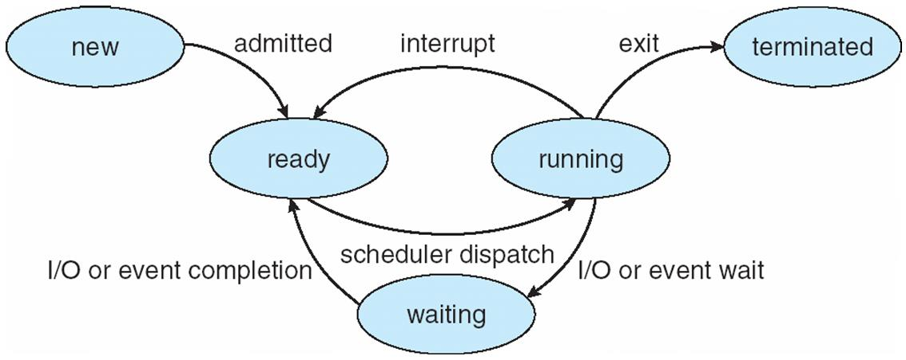

# 운영체제

- Computer Architecture Review
    - Program의 구조
        1. Application Software
        2. Systems Software
        3. Hardware
    - Program Code Levels
        1. High-level language
        2. Assembly language : 인스트럭션의 텍스트 표현
        3. Hardware Representation : 인코딩된 인스트럭션과 데이터
    - Arithmetic 연산
        - Integer 연산 : 범위 넘어가면 오버플로우 발생
            - -연산 대신 +연산하는 이유 : 비용 절감
        - Float notation
    - Processor, CPU
        - Pipelining Analogy
        - Its Hazards and Solutions
    - Memory Hierarchy
        - Locality
        - Cache Memory
            - Direct Mapped Cache
        - Virtual Memory
            - Page Fault
            - TLB
        - Disk
            - Seek Time
            - Flash Storage
            - SSD
    
- Introduction to OS
    - What is OS?
        - View of application
            - 운영체제는 실행중인 프로그램 위한 좋은 실행 환경을 제공해주는 것
            - 컴퓨터 시스템의 추상적인 뷰를 제공한다
        - System View
            - 운영체제는 컴퓨터 시스템의 다양한 리소스를 관리한다
                - 어떻게 공유해서 CPU를 쓰게해줄지
                - 보호
                - 어떻게 공평하게 나눌건지
                - 효율적이게 리소스를 사용할지
        - Implementation view
            - 높은 동시성
            - event-driven software (이벤트가 발생하면 해당 처리를 해주고 다시 대기)
    - Computer systems
        - 운영체제는 하드웨어와 Application 사이에 위치
    - 운영체제의 역사
        - 1세대
            - 그 시절은 운영체제 같은게 없었다
            - 프로그래밍언어도 없고 어셈블리 언어도 없다
            - ENIAC
        - 2세대 - 트랜지스터 및 메인프레임
            - 한 번에 한 작업만
            - 카드리더, 테이프 드라이브, 라인프린터를 입력으로 받음
            - OS는 항상 메모리에 상주하며 단지 제어권을 전송하기만 합니다.
            - CPU는 I/O 병목때문에 활용도가 낮다(처리가 오랜시간이 걸린다)
        - 3세대 - 집적회로
            - 구조적 장점
                - IC칩 사용 : 더 좋은 성능, 비용
                - 디스크 드라이버
                - on-line 터미널
                - “컴퓨터 아키텍처”라는 개념이 처음 나옴
            - 멀티프로그램 시스템 (여러 개의 프로그램을 한 번에)
                - CPU 성능 증가
                - 멀티 프로그래밍에 따라 요구되는 운영체제 기능 많아짐
                    - 작업 스케줄링
                    - 메모리 관리
                    - CPU 스케줄링
                    - Protection
                - 스풀링 (동시 주변기기 작동 온라인)
            - 시분할 시스템 (프로그램 여러개 동시에 도는것 처럼 보인다)
                - 응답 시간 향상
                - 따라서 운영체제는 더 복잡해진다
                    - 스와핑
                    - 가상 메모리
                    - 파일 시스템(파일이 서로 액세스하겠다하고)
                    - 복잡한 CPU 스케줄링
                    - 동기화
                    - 등등
        - 4세대 - LSIs & VLSIs
            - 구조적 장점
                - 마이크로프로세서 : 더 작고 더 빠름
                - 저장공간 : 더 크고 더 빠름
                - 개인이 컴퓨터를 들고 다닐 수 있게 됨
                - CPU 작업이 I/O 장치로 오프로드됨
            - 따라서 현대적인 운영체제가 요구되는 기능
                - GUI 제공
                - 멀티미디어 제공
                - 인터넷 & 웹
                - 네트워크 / 분산
    - 컴퓨터의 진화(역사)
        - 컴퓨터 기술의 발전 (반도체 산업의 발전)
            - Moore의 법칙
        - 새로운 applications 을 실현 가능하게 했다
        - 컴퓨터가 널리 보급되고 이동성이 뛰어나게 됨
    - 운영체제의 역사
        - CTSS → OS/360 → Multics → Unix
    - Multics
        - 다중화 정보 그리고 컴퓨팅 시스템
        - Innovations
            - 계층적 파일 시스템 (이 concept들이 지금도 사용 됨)
            - 분할 및 페이징을 포함한 가상 메모리 관리 분야의 많은 발전
            - OS 커널로부터 명령 Shell을 분리
            - 다이나믹 링킹
            - 고급언어로 OS 구현
            - 공유 메모리 관리
            - 보안 컴퓨터 시스템 분야의 많은 발전
            - 멀틱스 관계형 데이터 저장소 (MRDS) in 1976
                - 최초의 상용 relational 데이터 베이스 관리 시스템
                - MRDS의 쿼리 언어는 현재 SQL과 유사
                - 여러 프로세스에서 데이터베이스 동시 액세스 지원
                - DB 전체 백업 가능
            - 스프레드시트 개발됨
    - UNIX
        - Multics의 좋은 개념, 좋은 장점을 갖고 나옴
        - 한 사람이 본질적으로 1개월만에 만든 운영체제
        - Features
            - 계층적 파일 시스템
            - 프로세스 제어
            - Shells
            - Signals (Unix로 넘어오면서 생김)
    - Multics vs Unix
        - Multics
            - Top-down Approach
            - 150명이 디자인하고 시스템 프로그래밍함
            - 다른 50명이 구현함
            - 복잡하고, 비용이 비쌈
        - Unix
            - Bottom-up approach
            - 사용하기 단순함
            - 저비용 하드웨어, 대학에서 사용할 수 있다(교육용으로 사용 가능)
            - 2명의 소수 개발자가 개발함
            - 현대 운영체제의 Root가 됨
    - Linux
        - Unix를 기반으로 작성됨
        - 리눅스의 강점은 “오픈소스”, “호환성”
- Architectural Support for OS
    - OS Internals
        - User Space - Kernel Space
        - System Call을 통해 User Space에서 Kernel Space로 접근
        - 커널 영역은 파일시스템 관리, I/O 관리 -  메모리 관리 - 프로세스 관리 이러한 구조를 띈다
    - Computer Systems
        - 특징
            - I/O 장치와 CPU는 동시에 실행할 수 있다
            - 각 장치 컨트롤러는 로컬 버퍼를 가진다
            - CPU는 메인 메모리 ↔ 로컬 버퍼 간의 데이터를 이동시킨다
            - I/O는 메인 메모리와 I/O장치의 로컬 버퍼 간의 데이터 이동을 말한다
            - CPU는 특정 명령을 I/O 장치에 전달한다
    - 운영체제와 Architecture(하드웨어)
        - 운영체제의 기능적 부분은 아키텍처 기능(하드웨어적 기능)에 의해 제한받는다
        - 운영체제의 구조(운영체제가 할 일)는 Architectural 지원에 의해 단순화 될 수 있다.
        - 대부분의 독점 운영체제는 특정 Architecture를 염두에 두고 개발되었다.
    - Interrupts
        - 인터럽트는 하드웨어 장치에 의해 생성된다. (하드웨어가 OS에 간섭)
        - 커널(운영체제)가 I/O에게 작업이 끝났는지 어떻게 알릴건가?
            - Polling (CPU가 I/O에게 작업이 끝났는지 계속 물어봄)
            - Hardware interrupt (일이 잘 끝났는지 끝나고 물어봄, 인터럽트 발생여부 확인)
        - 인터럽트 핸들링
            - CPU의 상태를 보존 → 시스템 스택에
            - 인터럽트 타입을 확인
            - control을 인터럽트 서비스 루틴(ISR) 혹은 인터럽트 핸들러에 전송
    - Exceptions
        - 실행중인 소프트웨어 명령에 의해 생성됨 (응용 프로그램이 요청)
        - Traps
            - 의도적, 일부러 운영체제에 요청
            - 대부분 System Call,… 등등
            - 제어권을 다음 명령에게 돌린다
        - Faults
            - 의도적이지 않음, 운영체제가 recovery해서 사용자에게 안내함
            - Page faults (recoverable), protection faults (unrecoverable)
            - 오류가 있는("현재") 명령을 다시 실행하거나 중단합니다.
        - Aborts
            - 의도 X, 해결, 복구 X
            - Parity error, machine check
            - 현재 프로그램 (프로세스)를 종료시킨다
        - System Calls
            - 운영체제가 제공하는 서비스에 대한 프로그래밍 인터페이스 
            (커널에 접근하기 위한 인터페이스)
            - User Application에서 System Call 요청하면 System Call Table로 매핑해서
            System Call 처리하고 나온 리턴값을 다시 user application으로 반환해줌
            (system call을 통해 user space에서 kernel space로 접근)
    - Signals
        - 작동중인 프로그램 (프로세스)에 전송하는 정규화된 메시지
        - 특정 행동을 유도하는 것
        - 비동기적임
        - 프로세스나 스레드에게 인터럽트, 중단, 제거, kill 명령
        - When a signal is sent
            - 운영 체제는 신호를 전달하기 위해 대상 프로세스의 정상적인 실행 흐름을 중단합니다.
            - 프로세스가 이전에 시그널 핸들러를 등록 한 경우 해당 루틴이 실행됩니다.
            - 그렇지 않으면,기본 시그널 핸들러가 실행됩니다
        - Signal vs interrupts
            - 인터럽트는 하드웨어에 의해 mediated되고 커널에의해 handled
            - 시그널은 커널에의해 mediated되고 개별 프로세스에 의해 handled
    - DMA
        - Programmed I/O (PIO)
            - CPU 관여함
            - 입출력에 대한 준비가 되었는지 flag를 확인한 후 CPU가 입출력을 진행
            - 아주 작은 양의 Data 전송에 유용
        - DMA(Direct Memory Access)
            - CPU 관여  X
            - CPU가 입출력에 필요한 정보를 DMA 컨트롤러에 알리면 컨트롤러가 I/O를 수행
            - Device Controller는 블록단위로 데이터를 전송한다
            - 대용량의 Data 전송에 유리
            - 메모리 속도에 가까운 속도로 정보를 전송할 수 있는 고속 I/O 장치에 사용됩니다.
        - DMA 요청 과정
            1. CPU가 DMA 컨트롤러에 I/O 요청
            2. DMA가 메모리로 블록 단위로 데이터 전송
            3. I/O가 완료되면 CPU에 인터럽트 신호 전송
    - Timers
        - 작동중인 프로그램의 제어권을 가져오기 위해
        - 하드웨어 타이머가 주기적으로 인터럽트를 발생시킨다
        - 타이머는 privileged OS만이 불러올 수 있다.
    - Protected Instructions
        - Protected or privileged instructions
        - 운영체제만 할수있는 일을 하게 해주려고 커널 운영체제에서만 사용할 수있게함
            - 직접적으로 I/O 접근하면 안되니까
            - 메모리 상태를 관리하려고
            - 모드 비트를 사용
    - OS Protection
        - 커널과 유저모드로 나누어서 운영체제를 보호한다 (최소 2가지 모드는 지원해야)
        - 모드는 보호된 프로세서 레지스터의 상태 비트에 의해 설정됩니다.
        - 보호받는 명령어는 커널모드에서만 실행가능
        - 유저 프로그램은 privileged한 무언가를 하려면 운영체제를 call 해야한다
            - System Call이 다음같은 지시를 내려야한다
                - 커널 핸들러를 부르는 exception을 불러야한다
                - 호출할 시스템 콜을 나타내는 매개변수를 전달합니다.
                - caller의 상태(레지스터, 모드 비트)를 보호하고 복구
                - 완료되면 유저 모드로 돌아갈 방법을 제공해야한다.
    - Memory Protection
        - 운영체제는 다른 유저 프로그램으로부터 보호해야한다 : 악의적인 사용자로부터
        - 운영체제는 유저 프로그램으로 부터 스스로 보호해야한다. (OS 메모리를 건들지 못하게)
        - Base 레지스터와 Limit 레지스터를 사용하여 간단하게 보호
            - 여러 문제, 한계가 존재
        - MMU (메모리 관리 유닛) 사용 (CPU 내부에 존재)
            - 더 복잡한 메모리 보호 메커니즘을 제공
                - Base and Limit 레지스터
                - 페이지 테이블 포인터, TLBs, Page Protection
                - 가상 메모리
                - Segmentation Page
            - MMU는 protected operations (운영체제만 접근 가능하다)
                - CPU에서 나온 Virtual Address를 알맞은 Physical Address로 변환해 주는 작업을 수행
    - Synchronization
        - 중요한 계산 중 인터럽트 발생 → 계산이 잘못될 수 있다 → 동기화 필요
        - 운영체제는 동시 프로세스를 동기화할수 있어야한다
        - 인터럽트를 끄고 켜서
        - 특별한 atomic 명령어 사용
- Process
    - Program : 순서있는 명령어의 집합 in Storage
    - Process : 실행중인 Program in Memory
    - Processor : CPU, Hardware
    - Process Concept
        - 프로세스란 실행중인 프로그램의 인스턴스
        - 프로그램의 제어흐름의 캡슐화
        - 다이나믹하고 활동중인 엔티티 : 수행하고 있는 상태 → 변할 수 있다.
        - 실행과 스케줄링의 기본 단위
        - PID를 갖는다 (구별하기 위해)
        - 프로세스 include
            - CPU context (registers의 값)
            - 운영체제 리소스(메모리주소, 실행중인 파일 등)
            - 다른 정보(PID, state, owner)
        - Kernel이 사용하는 공간 (1G)
    - Process Creation
        - 프로세스 계층
            - 한 프로세스가 다른 프로세스를 만들면 부모-자식 관계
            - 계층 구조 : 프로세스 그룹 in UNIX
        - Process creation events
            - System Call을 불러서 : fork() in POSIX, CreateProcess() in Win32
            - System initalization
                - init process (제일 먼저 실행)
                - PID 1 process
        - Resource Sharing
            - 부모는 리소스의 모든 혹은 일부분 그리고 권한을 자식에게 상속할수있다
        - Execution
            - 부모는 끝날 때까지 대기하거나 병렬적으로 계속 할 수 있다.
        - Address Space
            - 자식은 부모의 주소공간 복제한다
    - Process Termination
        - Normal exit : 의도적 ex) return 0;
        - Error exit : 의도적 ex) return -1;
        - Fatal error : 의도 X
            - 할당된 리소스 초과
            - 세그멘테이션 폴트
            - 보호 결함
        - Killed by another process : 의도 X
    - fork() system call
        - 자식 프로세스를 생성하는 것
        - 자식 프로세스에게 부모의 전체 가상 주소 공간을  복사해서 넘겨줌
        - 자식을 관리하기 위해 내부 자료 구조를 복사
        - 부모는 자식의 pid를 리턴받음
        - 자식은 0을 리턴받음
    - Zombie Process
        - 실행이 완료됐거나 exit 한 프로세스지만 여전히 프로세스 테이블에 남아있는 프로세스
        - child는 죽고 parent가 return 값을 가져가지 않으면 zombie process
        - 이는 상위 프로세스가 하위 프로세스의 종료 상태를 읽을 수 있도록 항목이 여전히 필요 한 하위 프로세스에서 발생합니다.
    - Orphan Process
        - 부모가 종료 or 종료되고 자식은 여전히 작동중인 경우 자식은 Orphan process
        - Orphan process는 init system process에게 즉시 입양된다
    - Process State Transition
        
        
        
        new에서 프로세스가 admitted되면 ready 상태로 들어가고 운영체제가 프로세스를 스케줄링해준다 (scheduler dispatch) 그럼 running 상태로 들어간다. 만약 I/O인터럽트가 발생하면 running 상태인 프로세스는 ready 상태로 돌아간다. I/O 혹은 이벤트 wait 요청오면 waiting 상태로 가고 I/O 혹은 이벤트 끝내면 ready 상태로 들어간다.
        
    - PCB (Process Control Block)
        - 각 PCB는 프로세스를 나타냅니다. : 각 프로세스마다 PCB를 보유
        - 프로세스에 대한 모든 정보를 포함
            - 프로그램 상태
            - PC
            - SP
            - CPU 레지스터 값
            - CPU 스케줄링 정보
            - 메모리 관리 정보
            - accounting 정보
            - I/O 상태 정보 등등
        - Linux의 PCB : task_struct
    - PCB 와 하드웨어 상태
        - 프로세스 작동중일때
            - 하드웨어 상태는 CPU 내부에 있다 : PC, SP, registers
        - OS가 프로세스 실행을 중지할 때
            - 이 때 지금까지의 레지스터 값을 PCB에 저장한다
        - OS가 프로세스를 다시 작동 상태로 돌아가는 경우
            - PCB에서 값으로부터 하드웨어 레지스터를 불러온다. (복구)
    - Context Switch
        - 한 프로세스에서 다른 프로세스로 CPU 전환
        - 오버헤드 관리
            - 레지스터와 메모리 맵 저장 및 로드
            - 메모리 캐시 플러시 및 다시 로드
            - 다양한 테이블 및 목록 등 업데이트
        - context switch 오버헤드는 하드웨어 지원에 달려있다.
            - UltraSPARC의 다중 레지스터 세트 
            → 다중 레지스터니까 PCB에 저장, 삭제 과정이 줄어듬
            - 고급 메모리 관리 기술을 사용하려면 각 컨텍스트에 따라 추가 데이터를 전환해야 할 수 도 있습니다.
    - 프로세스 상태 큐
        - 상태 큐
            - OS는 시스템의 모든 프로세스 상태를 나타내는 큐의 집합을 유지 관리합니다.
                - Ready Queue
                - Wait Queue
            - 각 PCB는 현재 상태에 따라 상태 큐에 들어갑니다.
            - 프로세스 상태가 변경되면 해당 PCB가 다양한 큐 사이에서 마이그레이션됩니다.
        - PCBs and state queues
            - PCBs는 데이터 구조
                - OS 메모리 내부에서 동적으로 할당
            - 프로세스가 생성될 때
                - OS는 PCB를 할당
                - PCB 초기화
                - PCB를 올바른 큐에 배치
            - 프로세스는 다음을 compute한다
                - OS는 PCB를 큐에서 큐로 이동시킨다
            - 프로세스가 종료되면
                - PCB를 할당 해제한다.
    - Process Creation : UNIX
        - fork()
            - 새로운 PCB를 생성하고 초기화합니다.
            - 새 주소 공간을 생성하고 초기화합니다.
            - 상위 주소 공간의 전체 내용을 복사하여 주소 공간을 초기화합니다.
            - 부모가 사용하는 리소스(예: 열린 파일)를 가리키도록 커널 리소스를 초기화합니다.
            - PCB를 준비 대기열에 배치합니다.
            - 자식의 PID를 부모에게 반환하고 자식에게는 0을 반환합니다.
        - exec()
            - 현재 프로세스를 중지합니다.
            - 생성할 프로그램 "prog"를 프로세스의 주소 공간에 로드합니다.
            - 새 프로그램에 대한 하드웨어 컨텍스트 및 인수를 초기화합니다.
            - PCB를 준비 대기열에 배치합니다.
                - 참고: exec()는 새 프로세스를 생성하지 않습니다.
    - Process Creation: NT
        - CreateProcess()
            - 새로운 PCB를 생성하고 초기화합니다.
            - 새 주소 공간을 생성하고 초기화합니다.
            - "prog"로 지정된 프로그램을 주소 공간에 로드합니다.
            - 주소 공간에 할당된 메모리에 "args"를 복사합니다.
            - 메인에서 실행을 시작하기 위해 하드웨어 컨텍스트를 초기화합니다.
            - PCB를 준비 대기열에 배치합니다.
    - Why fork()?
        - Very useful when the child …
            - 부모와 협력하고 있다
            - 작업을 수행하기 위해 부모의 데이터에 의존합니다.
            - 예: 웹 서버
    - Inter-Process Communications
        - Inside a machine
            - 파이프 : 저용량의 경우
            - FIFO : 저용량
            - 공유 메모리 : 대용량의 경우
            - 소켓 : 대용량
        - Across machines
            - Sockets
            - RPCs (Remote Procedure Calls)
            - Java RMI (Remote Method Invocation)
        
- Threads
    
    > Processes
    > 
    
    Heavy - weight  : 무겁다 → 관리가 쉽지않다
    
    - 프로세스에는 다음과 같은 많은 항목이 포함됩니다.
        - 주소 공간(모든 코드 및 데이터 페이지)
        - OS 리소스(예: 열린 파일) 및 계정 정보
        - 하드웨어 실행 상태(PC, SP, 레지스터 등)
    - 새로운 프로세스를 만드는 데 비용이 많이 든다 왜냐하면 모든 데이터 구조를 할당하고 초기화해야 하기 때문입니다.
    - 프로세스 간 통신에는 비용이 많이 듭니다., 일반적으로 OS를 거쳐야 하기 때문에
        - 시스템 콜 그리고 데이터 복사 오버헤드
    
    > Cooperating Processes
    > 
    - 우리는 다음을 수행해야 합니다.
        - 병렬로 실행되는 여러 프로세스 만들기
        - 각각이 동일한 주소 공간을 매핑하여 데이터를 공유하도록 합니다.
            - 예를 들어, 공유 메모리
        - OS가 이러한 프로세스를 병렬로 예약하도록 합니다.
    - 이것은 매우 비효율적입니다!
        - 공간: PCB, 페이지 테이블 등
        - 시간: OS 구조 생성, 주소 공간 포크 및 복사 등
    
    > Rethinking Processes
    > 
    - 이러한 협력 프로세스에서 유사한 점은 무엇입니까?
        - 그들은 모두 동일한 코드와 데이터(주소 공간)를 사용(공유?)합니다.
        - 모두 동일한 권한을 사용합니다.
        - 모두 동일한 리소스(파일, 소켓 등)를 사용합니다.
    - 무엇이 다른가요?
        - 각각에는 PC, 레지스터, SP 및 스택과 같은 자체 하드웨어 실행 상태가 있습니다.
    
    > Key Idea
    > 
    - 프로세스의 개념을 실행 상태와 분리하세요
        - 프로세스: 주소 공간, 자원, 기타 일반 프로세스 속성
            - 예를 들어 특권
        - 실행 상태: PC, SP, 레지스터 등
    - 이 실행 상태는 일반적으로 호출됩니다.
        - 스레드
        - 경량 프로세스(LWP)
        - 제어 스레드