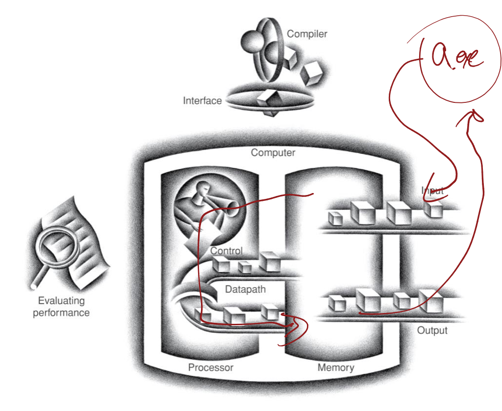

# 시스템 소프트웨어

Created: 2023년 9월 6일 오후 4:

Referecnd By : CBNU Prof. Heeseung Jo. 

---

## 00. COMPUTER ARCHITECTURE REVIEW

### 컴퓨터의 구성 요소 (Components of a Computer)

모든 종류의 컴퓨터의 동일한 구성 요소 (Same components for all kinds of computer)

- 데스크탑, 서버, 임베디드

Input / Output includes

- 유저 인터페이스 장치
    - 디스플레이, 키보드, 마우스
- 저장 장치
    - HDD, CD/DVD, Flash 메모리
- 네트워크 어댑터
    - 다른 컴퓨터와의 소통
    
    
    

### 성능 이해 (Understanding Performance)

- 알고리즘 **(좋은 알고리즘과 퍼포먼스와 연관)**
    - 실행된 작업 수를 결정한다
- 프로그래밍 언어, 컴파일러, 아키텍쳐
    - **작업당 실행된 기계 명령어 수**를 결정한다.
- 프로세서 및 메모리 시스템
    - **명령어가 얼마나 빨리 실행되는지** 결정한다.
- 입출력 시스템 (운영체제 포함)
    - 입출력 작업이 얼마나 빨리 실행되는지 결정한다.

### 성능 정의 (Defining Performance)


**무엇을 성능의 측도(기준)으로 볼지에 따라 다르다는 것 이해하기**

### 응답 시간과 처리량 (Response Time and Throughput)

- 응답 시간 (Response Time) : 프로그램의 소요 시간
    - 작업을 완료하는데 걸리는 시간
- 처리량 (Throughput) : 분, 시간당 시간
    - 단위 시간당 수행된 전체 작업량을 의미
        - e.g. 시간당 작업/트랜잭션/…
- 응답 시간 및 처리량은 어떻게 영향을 받을까?
    - 프로세서를 더 빠른 버전으로 교체하는 경우?
    - 더 많은 프로세서를 추가하는 경우?
- 우리는 **응답시간**에 더 초점을 맞출 것

### 프로그램 코드의 단계(Level)

- 고급 언어
    - 문제 영역에 더 가까운 추상화 수준
    - 생산성과 이식성을 제공
- 어셈블리 언어
    - 명령어의 텍스트 표현
- 하드웨어 표현
    - 이진 숫자(비트)
    - 인코딩된 명령어와 데이터
    
    
    

### 번역 및 스타트업 (Translation and Startup)


1. C 프로그램이 컴파일러를 거쳐 어셈블리 언어 프로그램으로 변환
2. 어셈블리 언어 프로그램이 어셈블러를 거쳐 오브젝트(기계 언어 모듈)
3. 기계 언어 모듈과 라이브러리 루틴이 링커를 통해 링킹 과정을 거치면
4. 실행가능한 기계 언어 프로그램으로 그리고 로더를 통해 메모리에 적재

### MIPS R-format Instructions


- 명령어 fields
    - op: 작업 코드(opcode)
    - rs: 첫 번째 소스 레지스터 번호
    - rt: 두번째 소스 레지스터 번호
    - rd: 대상 레지스터 번호
    - shamt : 시프트량(일단 00000)
    - funct : function code (extends opcode)
    
    ### **R-format 예시**
    
    
    

---

## 01. Introduction

### Course Theme : 추상화는 좋지만, 현실을 잊지 말자!

- 대부분의 CS와 CE 과목은 추상화에 중점을 둔다.
    - 추상 데이터 타입
    - 점근적 분석
- 이러한 추상화에는 한계가 있다.
    - 특히 버그가 있다면 더욱 그렇다
    - **기반 구현의 세부 사항을 이해해야 한다.**
- 유용한 결과
    - 더 효과적인 프로그래머가 된다.
        - 버그를 효율적으로 찾아서 제거할 수 있다.
        - 프로그램 성능을 이해하고 조정할 수 있다.
    - 나중에 “시스템” 수업을 위해 준비할 수 있다.
        - 컴파일러, 운영체제, 네트워크, 컴퓨터 구조, 임베디드 시스템 등

### **Great Reality #1**

Ints는 Integers가 아니고, Floats는 Reals가 아니다


CS에서 Ints 라는게 수학적으로 정수라는 건 아니라는 말을 하고 싶은 듯 범위의 한계가 있다?


- Code 보안 예시
    
    ```c
    /* Kernel memory region holding user-accessible data */
    #define KSIZE 1024
    char kbuf[KSIZE];
    /* Copy at most maxlen bytes from kernel region to user buffer */
    int copy_from_kernel(void *user_dest, int maxlen) {
    	/* Byte count len is minimum of buffer size and maxlen */
    	int len = KSIZE < maxlen ? KSIZE : maxlen;
    	memcpy(user_dest, kbuf, len);
    	return len;
    }
    ```
    
- 일반적인 사용
    
    ```c
    /* Kernel memory region holding user-accessible data */
    #define KSIZE 1024
    char kbuf[KSIZE];
    /* Copy at most maxlen bytes from kernel region to user buffer */
    int copy_from_kernel(void *user_dest, int maxlen) {
    	/* Byte count len is minimum of buffer size and maxlen */
    	int len = KSIZE < maxlen ? KSIZE : maxlen;
    	memcpy(user_dest, kbuf, len);
    		return len;
    }
    ```
    
    ```c
    #define MSIZE 528
    void getstuff() {
    	char mybuf[MSIZE];
    	copy_from_kernel(mybuf, MSIZE);
    	printf(“%s\n”, mybuf);
    }
    ```
    

### 컴퓨터 산술

일반적인 수학적인 속성을 모두 가정할 수는 없음

- 표현의 유한성으로 인해서
- 정수 연산은 “ring” 속성을 만족함
    - 교환법칙, 결합법칙, 분배법칙
- 부동 소수점 연산은 “ordering” 속성을 만족함
    - 단조성, 부호 값

Observation

- 어떤 추상화가 어떤 문맥에서 적용되는지 이해해야 한다.
- 컴파일러 작성자와 심각한 응용 프로그래머에게 중요한 문제

**수학 현상을 시뮬레이션 해주는 것이지, 실제 수학적 논리와 완전 동일하지는 않음**

### Great Reality #2:

**어셈블리를 알 필요가 있다.**

아마도 어셈블리어로 프로그램을 작성하지 않을 것임

- 컴파일러는 작성자보다 **훨씬 더 좋고 인내심이 있다**

하지만! 어셈블리를 이해하는 것은 **Machine-level 실행 모델에 필수적.**

- 버그가 있는 상황에서의 프로그램 동작
    - 고급 언어 모델이 무너진다(break down)
- 프로그램 성능 튜닝
    - 컴파일러에 의한 최적화의 done / not done을 이해하기
    - 프로그램의 비효율성의 원인을 이해하기
- 시스템 소프트웨어 구현 (Implementing)
    - 컴파일러는 기계 코드를 대상으로 한다.
    - 운영 체제는 프로세스 상태를 관리해야 한다.
- 악성 소프트웨어(Malware) 생성 / 대응

**어셈블리 코드 예시**

- 타임 스탬프 카운터
    - 인텔 호환 기계의 특별한 64비트 레지스터
    - 클럭 주기 마다 증가 (클럭이 몇번 뛰었는지 Count)
    - rdtsc 명령에 따라 읽기
- Application
    - 절차에 필요한 시간(in clock cylces) 측정
    
    ```c
    double t;
    start_counter();
    P();
    t = get_counter();
    printf("P required %f clock cycles\n", t);
    ```
    

**카운터를 읽는 코드**

GCC의 asm 기능을 사용하여 작은 어셈블리 코드를 작성합니다

어셈블리 코드를 컴파일러가 생성한 기계 코드에 삽입합니다.

```c
static unsigned cyc_hi = 0;
static unsigned cyc_lo = 0;
/* Set *hi and *lo to the high and low order bits
of the cycle counter.
*/
void access_counter(unsigned *hi, unsigned *lo)
{
asm("rdtsc; movl %%edx,%0; movl %%eax,%1"
: "=r" (*hi), "=r" (*lo)
:
: "%edx", "%eax");
}
```

### Great Reality #3:

**랜덤 메모리 접근은 물리적이지 않은 추상화입니다**

- 메모리는 무한하지 않다
    - 메모리는 할당되고 관리되어야 한다.
    - 많은 애플리케이션이 메모리를 지배한다
- 버그를 참조하는 메모리는 특히 유해하다
    - 시간과 공간 모두에서 효과가 멀리있다 (효과적이지 않다?)
- 메모리 성능이 일정하지 않다
    - 캐시와 가상 메모리 효과가 프로그램 성능에 크게 영향을 미칠 수 있다
    - 프로그램을 메모리 시스템에 맞추면 속도가 크게 향상 될 수 있다.

- 메모리 참조 버그 예시

```c
double fun(int i)
{
	volatile double d[1] = {3.14};
	volatile long int a[2];
	a[i] = 1073741824; /* Possibly out of bounds */
	return d[0];
}
```

fun(0)   3.14
fun(1)   3.14
fun(2)   3.1399998664856
fun(3)   2.00000061035156
fun(4)   3.14, then segmentation fault

결과가 아키텍처에 따라 다르다

- 메모리 참조 오류
    - C와 C++은 메모리 보호 기능을 제공하지 않음
        - 배열 범위를 벗어난 참조
        - 유효하지 않은 포인터 값
        - malloc/free의 남용
    - 이로 인해 심각한 버그가 발생할 수 있다
        - 버그의 영향 여부는 시스템 및 컴파일러에 따라 다르다
        - 원치않는 객체가 손상되는 경우
            - 접근 중인 객체와 논리적으로 관련이 없는 객체가 손상됨
            - 버그의 영향이 발생한 이후에야 처음으로 손상이 관찰될 수 있다
    - 어떻게 이를 대처할 수 있을까?
        - Java, Ruby 혹은 ML로 프로그래밍하기
        - 가능한 상호작용 이해하기
        - 참조 오류를 감지하기 위해 개발 도구 사용하기
- 메모리 시스템 성능 예시
    
    
    
    왼쪽 코드가 더 좋은 성능
    
    **계층적 메모리 구조를 이해할 필요가 있다**
    
    - 성능은 액세스 패턴에 달려있다
        - 다차원 배열을 단계적으로 수행하는 방법을 포함하여
- 메모리 마운틴
    
    
    

### Great Reality #4:

**점근적 복잡성보다 성능에 더 많은 것이 있습니다**

- 알고리즘, 데이터 표현, 절차 그리고 루프 등 여러 수준에서 최적화 해야한다
    - 코드 작성 방법에 따른 10:1 성능 범위를 쉽게 확인할 수 있
- 성능을 최적화하려면 시스템을 이해해야 한다.
    - 어떻게 프로그램이 컴파일되고 실행되는지
    - 프로그램 성능을 측정하고 병목 현상을 식별하는 방법
    - 코드 모듈성과 일반성을 훼손하지 않고 성능을 향상시키는 방법

**행렬 곱셈 예제**


- 최적화 플래그를 사용하는 표준 데스크탑 컴퓨터, 공급업체 컴파일러 두 구현 모두 
정확히 동일한 작업 수를 가진다 (2n^3)

**MMM Plot: Analysis**


### Great Reality #5:

**컴퓨터는 프로그램을 실행하는 것 이상을 한다**

- 데이터를 가져오고 내보내야 한다
    - 프로그램 안정성과 성능에 중요한 입출력 시스템
- 네트워크를 통해 서로 통신한다
    - 네트워크가 존재하면 시스템 수준의 문제가 많이 발생한다
        - 자율적인 프로세스에 의한 동시 운영
        - 신뢰할 수 없는 미디어에 대한 대처
        - 크로스 플랫폼 호환성
        - 복잡한 성능 문제

---

## 02. Digital Systems

### Introduction

- 아날로그 vs 디지털?
    - Value가 연속적이냐 비연속적이냐
    
    
    
- CD
- MP3

### Representing Information

- **Information = Bits + Context**
    - 컴퓨터는 사물의 표현을 조작한다
    - 사물은 이진 숫자로 표시된다
    - N비트로 무엇을 표현할 수 있는가?
        - 2^N개의 것들
        - 숫자, 문자, 픽셀, 위치, 소스코드, 실행가능한 파일, 기계 명령어, …
        - 어떤 작업을 수행하느냐에 따라 달라진다
        
        
        

### Binary Representations

- Why not base 10 representation? 왜 10 진수 표현은 안되는가?
    - 안정적인 요소로 보관이 용이함
    - 산술 함수의 간단한 구현
    - noisy가 크고 부정확한 wires를 통해 안정적으로 전송
    
    
    

### Encoding Byte Values

- Byte = 8 bits
    - 2진수 : 000000 to 111111
    - 8진수 : 0으로 시작하는 정수 상수는 C에서 8진수이다.
    - 10진수 : 첫 자리는 C에서 0이 될 수 없다
    - 16진수 : ‘0’ to ‘9’ and ‘A’ to ‘F’ 문자 사용

### Boolean Algebra

- 1849년에 George Boole에 의해 개발됨
    - 논리의 대수적 표현
        - “True” = 1 and “False” = 0
    - And, Or, Not, Exclusive-Or (Xor)
    
    
    
- 가산기 (Adder)
    
    
    
- 플립플롭 (Flip-Flops)
    
    
    

### Digital Systems

- Summary
    - **부울 대수는 현재 디지털 시스템의 수학적 기초이다**
    - 부울 대수는 스위치로 구성된 회로를 효과적으로 설명하는 수단을 제공한다.
    - 클로드 샤넌, 1930년대 후반
    - **NAND 게이트로 모든 디지털 시스템을 구축할 수 있다**
    - CMOS 트랜지스터로 쉽게 NAND 게이트를 구성할 수 있다
    - 트랜지스터는 디지털 시스템의 기본 구성 요소이다

---

## 03. Representing and manipulating integers

### Unsigned Integers

**Unsigned Integers 를 인코딩 하는 법**


w 비트로 표현되는 부호 없는 값의 범위는 무엇인가?

### Signed Integers

- positive numbers 를 인코딩 하는 법
    - Unsigned numbers와 동일하다
- negative numbers를 인코딩 하는 법
    - Sign-magnitude 표현
    - One’s complement 표현
    - Two’s complement 표현
- Sign-magnitude 표현
    
    
    
    가장 앞쪽 비트가 부호비트 나머지가 숫자 표현? 
    
- 1의 보수 표현
    
    
    
    - -n을 찾기 쉬움
    - 두 개의 0
    - 더 이상 사용 안함
- 2의 보수 표현
    
    
    
    - 유일한 0
    - 하드웨어에게 쉬움
    - 거의 대부분 현대 기계에 사용됨
    
    2의 보에 대해 다음 식이 성립
    
    ```c
    ~x + 1 = -x
    ```
    
    - Increment
        - ~x + x == -1
        - ~x + x + (-x + 1) == -1 + (-x + 1)
        - ~x + 1 == -x


### 숫자 범위 (Numeric Ranges )

- Unsigned values
    - UMin = 0  [000..00]
    - UMax =
    
    $$
    2^w - 1 [111....11]
    $$
    
- 2의 보수 values
    - TMin =
    
    $$
    -2^{w-1} [100..00]
    $$
    
    - TMax =
    
    $$
    2^{w-1}-1[011...11]
    $$
    
    
    
- 다른 word sizes에 따른 values
    
    
    

### 타입 변환 (Type Conversion)

- Unsigned : wbits ⇒ w+k bits 비트 공간 크기 증가시키면
    - Zero extention: **k비트 만큼을 0으로 채우기 즉, 앞 쪽을 0으로 채운다**
    
    
    
    작은 공간 ⇒ 큰 공간 : 문제 X
    
    큰 공간 ⇒ 작은 공간 : 문제 O
    
- Signed: w bits ⇒ w+k bits
    - Given w-bit signed integer X
    - 같은 값의 w+k 비트 정수로 변환
- Sign extention
    - **k 비트 부분을 부호 비트로 채우기** 
    (앞 쪽을 부호비트와 동일하게 채우기 : 값 유지를 위해)
    
    
    
    - 예시
        - 작은 정수형에서 더 큰 정수형으로 변환
        - C는 자동으로 부호 확장을 수행한다
    
    
    
- Unsigned & Signed : w+k bits ⇒ w bits
    - w bits 보다 낮은 부분 하위 w 비트만 남기고 나머지는 잘라낸다
    - x mod 2^w와 동일하다
    
    
    
- Unsigned ⇒ Signed
    - 동일한 비트 패턴은 부호가 있는 숫자로 해석된다
    
    
    
- Signed ⇒ Unsigned
    - 순서 반전
    - 음수 ⇒ 큰 양수
    
    
    

### C에서의 타입 변환 (Type Conversion in C)

- 상수
    - 기본적으로 부호 있는 정수로 간주한다 (default가 Signed)
    - ‘U’ 또는 ‘u’ 접미사가 있는 경우에는 Unsigned 정수
        - 0U, 12345U, 0x1A2Bu
- 타입 변환
    - 명시적 타입 변환
    - 할당을 통한 암시적(Implicit) 타입 변환
        - 할당
        - 프로시저 호출
- 표현식 평가
    - 하나의 표현식에서 부호 있는 값과 부호 없는 값을 혼합하면, 
    부호 있는 값은 암시적으로 부호 없는 값으로 형 변환된다.
    - 이는 <, >, ==, ≤, ≥와 같은 비교 연산을 포함한다.
    
    | Expression | Type | Evaluation |
    | --- | --- | --- |
    | 0 == 0U | Unsigned | True |
    | -1 < 0 | Signed | True |
    | -1 < 0U | Unsigned | False |
    | -1 > -2 | Signed | True |
    | (Unsigned) -1 > -2 | Unsigned | True |
    | 2147483647 > -2147483647-1 | Signed | True |
    | 2147483647U > -2147483647-1 | Unsigned | False |
    | 2147483647 > (int) 2147483648U | Signed | True |
- Example 1-1
    
    ```c
    int main ()
    {
    	unsigned i;
    	for (i = 10; i >= 0; i--)
    	printf ("%u\n", i);
    } //
    ```
    
    잘못된 코드임 i ≥ 0 조건에 의해 최종적으로 i = -1이 되는데, i는 unsigned 이므로 unsigned int 최대 값으로 overflow 됨 따라서 무한히 반복
    
- Example 1-2
    
    ```c
    int main ()
    {
    	unsigned i;
    	for (i = 10; i > 0; i--)
    	printf ("%u\n", i);
    }
    ```
    
- Example 2
    
    ```c
    int sum_array (int a[], unsigned len)
    {
    	int i;
    	int result = 0;
    	for (i = 0; i <= len - 1; i++)
    		result += a[i];
    	return result;
    }
    ```
    
    len ≤ 일 때 무한 반복하게 된다. len은 unsigned 이므로 0이하일 때 -1 해주면 42억 언저리로 되서 무한 반복하게 됨
    
- Example 3-1
    
    ```c
    void copy_mem1 (char *src, char *dest, unsigned len)
    {
    	unsigned i;
    	for (i = 0; i < len; i++)
    		*dest++ = *src++;
    }
    ```
    
- Example 3-2
    
    ```c
    void copy_mem2 (char *src, char *dest, unsigned len)
    {
    	int i;
    	for (i = 0; i < len; i++)
    		*dest++ = *src++;
    } /
    ```
    
    len ≥ INT_MAX 일 경우 문제가 발생한다.  i가 signed 이므로 len이 signed int의 최대 범위를 넘어가면 
    
- Example 3-3
    
    ```c
    void copy_mem3 (char *src, char *dest, unsigned len)
    {
    	for (; len > 0; len--)
    		*dest++ = *src++;
    }
    ```
    
- Example 3-4
    
    ```c
    void copy_mem4 (char *src, char *dest, unsigned len)
    {
    	for (; (int) len > 0; len--)
    		*dest++ = *src++;
    } /
    ```
    
    len ≥ INT_MAX 일 경우 문제 발생 오버플로우가 발생하여 음수가 되어 아예 반복하지 않음
    
- Example 4
    
    ```c
    #include <stdio.h>
    int main ()
    {
    	unsigned char c;
    	while ((c = getchar()) != EOF)
    		putchar (c);
    }
    ```
    
    c에 -1을 대입할 수 없어서 무한 반복한다
    
- Lessons
    - 부호 없는 정수를 사용할 때에는 많은 까다로운 상황이 있으며, 디버깅 하기 어려움
    - **숫자가 음수가 아니라는 단순한 이유로 사용하지 말 것 (웬만하면 사용하지 말 것)**
    - **제한된 비트 내에서 큰 양의 양수를 나타내려면 “unsigned”를 사용**
    - **숫자적 해석이 없는 비트의 모음(”플래그”)이 필요한 경우 사용 (꼭 써야하는 cases)**
    - C 이외의 언어에서는 부호 없는 정수를 지원하는 언어가 거의 없음
    

### Bit-Level Operations in C

- C에서 이용가능한 명령들 “&, |, ~, ^”
    - 정수 데이터 유형에 적용됨
        - long, int, short, char, unsigned
    - 인수를 비트 벡터로 간주
    - 비트별로 인수를 적용
- C에서의 논리 명령들
    - &&, ||, !
    - 0을 “False”로 본다
    - “True”는 0이 아닌 모든 수
    - 항상 0 혹은 1을 리턴
    
    
    
    더 빠른 코드는 두번 째 코드 : 
    i > c 조건이 이미 False 이기 때문에 뒤에 조건을 볼 필요도 없기 때문이다
    
- Examples
    - !0x41 --> 0x00
    - !0x00 --> 0x01
    - !!0x41 --> 0x01
    - 0x69 && 0x55 --> 0x01
    - 0x69 || 0x55 --> 0x01
- Left shift : x << y (x를 y만큼 left 시프트)
    - 왼쪽의 여분의 비트를 버린다
    - 오른쪽 비트를 0으로 채운다
- Right shift : x >> y (x를 y만큼 right 시프트)
    - Logical shift
        - 왼쪽을 0으로 채운다
    - Arithmetic shift
        - 오른쪽에 MSB 복제
        - 2의 complement 정수 표현에 유용함
    - y < 0 또는 y ≥ word 크기인 경우 정의되지 않음(컴파일러의 로직따라 다르다)
    
    
    
- Right shift Example
    
    ```c
    void main()
    {
    	char i = -2;
    	printf("%d\n", i); // -2
    	i = i >> 2;
    	printf("%d\n", i); // -1
    }
    ```
    
    “Arithmetic shift right”가 C에서의 기본 명령이다
    
    ```c
    void main()
    {
    	char i = -2;
    
    	printf("%d\n", i); // -2
    	i = i >> -2; // 절대값 취해서 처리함
    	printf("%d\n", i); // -1
    }
    ```
    

### 정수 덧셈 예시


- 4 비트 정수 u, v
- Compute true sum
- True sum은 하나의 더 많은 비트를 요구한다(”carry”플래그 비트)
- 값은 u와 v와 선형적으로 증가함
- 평면 표면을 형성함
- 부호없는 수 덧셈
    
    
    
    - Ignores carry output
    - Wraps around
        - If true sum ≥ 2^w
        
        
        
- 부호 있는 수 덧셈
    
    
    
    - Drop off 최상위비트(MSB)
    - 나머지 비트를 2의 보수로 취급
        
        
        
- C에서의 부호있는 수 덧셈
    - carry 출력을 무시
    - 최하위 w비트는 부호 없는 덧셈과 동일하다
        
        
        

### 곱셈

- Ranges of (x * y)
    - 부호없는 경우 : 최대 2w 비트 : (곱해 담으려면 2배만큼 공간 필요)
        
        
        
    - 2의 보수 최솟값 : 최대 2w -1 비트 :
        
        
        
    - 2의 보수 최댓값 : 최대 2w 비트 (TMin^2 에만 해당)
        
        
        
- 정확한 결과 유지
    - 각 곱셈별로 워드 크기를 확장해야 한다
    - 소프트웨어에서 “임의 정밀도” 산술 패키지로 수행된
- C에서의 부호없는 곱셈
    - 상위 w 비트를 무시한다
    - 모듈러 산술을 구현한다
        
        
        
        
        
- C에서의 부호있는 곱셈
    - 상위 w 비트를 무시한다
    - 하위 w 비트는 부호 없는 곱셈과 동일하다
    
    
    
- 2의 거듭제곱을 시프트하여 곱셈
    - u << k는 u * 2^k를 의미한다
        - ex) u << 3은 u*8 과 동일하다
    - 부호 있는 정수와 부호 없는 정수 모두 가능하다
    - **대부분의 기계는 곱셈보다 시프트와 덧셈을 더 빠르게 처리한다**
    - 컴파일러는 이 코드를 자동으로 생성한다
    
    
    
- 컴파일된 곱셈 코드
    - 상수와 곱할 때 C 컴파일러는 자동으로 시프트/덧셈 코드를 생성한다
        
        
        

### 나눗셈

- 시프트를 사용한 2의 거듭제곰으로 나누기 (양수 포함)
    - u >> k는 |_ u / 2^k _| 을 제공한다
    - 논리 시프트를 사용한다
    
    
    
    
    
- 컴파일된 부호없는 나눗셈 코드
    - **부호 없는 경우에는 논리적 시프트를 사용한다**
    - 자바에서는 논리적 시프트를 >>>로 표기한다
    
    
    
- 시프트를 이용한 2의 거듭제곱 나눗셈
    - x >> k 는 |_ x / 2^k _| 을 제공
    - 산술 시프트를 이용하여 **(x < 0인 경우 반올림 방향이 잘못 일어난다)**
    
    
    
    
    
- 올바른 2의 거듭제곱 나눗셈
    - x < 0 일때 (Round Toward 0)를 원하는데 실제로 안 그럼
    - ceiling((x + 2^k - 1) / 2^k)으로 처리
        - C에서 : (x + (1 << k) - 1) >> k
        - 나누는 수를 0으로 향하도록 편향시킨다
    - Case 1 : No rounding
        - Biasing has no effect
            
            
            
    - Case 2 : Rounding
        - Biasing adds 1 to final result
            
            
            
- 컴파일된 부호있는 나눗셈 코드
    - 부호 있는 산술 시프트를 사용한다
    - 부호 있는 산술 시프트는 Java에서 >>로 표시된다
        
        
        
        
        
- Example
    
    ```c
    void main()
    {
    	char i = -17;
    	printf("%d\n", i); // -17
    	i = i / 8;
    	printf("%d\n", i); // -2
    	i = i >> 3;
    	printf("%d\n", i); // -1
    }
    ```
    

---

## 04. Representing and manipulating floating points

**문제 상황**

- 유한한 비트 수로 분수 값을 표현하는 방법은 무엇일까?
    - 0.1
    - 0.612
    - 3.14159265358979323846264338327950288. . .

### 이진수 소수


- 표현
    - 이진수 오른쪽 비트는 2의 분수 거듭제곱을 나타냅니다
    - 유리수를 나타낸다 :
        
        
        
- 예시:
    
    
    
- Observation
    - 오른쪽으로 시프트 이동하여 2로 나눈다
    - 왼쪽으로 시프트 이동하여 2로 곱한다
- 표현가능한 숫자
    
    
    

### 고정 소수 표현

**고정 소수 표현**

- Example: 17.14 fixed-point representation
    - 1 bit for sign bit
    - 17 bits for the integer part
    - 14 bits for the fractional part
    - An integer x represents the real number x / 214
    - Maximum value: (231 - 1) / 214 ≒ 131071.999
    
    
    
- 속성
    - n을 고정 소수로 변환
    - Add x and y :
        
        
        
    - Subtract y from x:
    - Add x and n
    - Multiply x by n
    - Divide x by n
- **장점**
    - 간단하다
    - **정수연산을 사용하여 조작할 수 있다**
    - 부동 소수점 하드웨어가 필요 없다
    - 많은 저비용 임베디드 프로세서 혹은 DSPs (digital signal processors)에 사용된다
- **단점**
    - 넓은 범위의 수를 표현할 수 없다
        - 1광년
        - 산소 원소의 지름
- 
    
    

### Representing Floating Points

- IEEE 표준 754
    - 모든 주요 CPU 지원
    - 윌리엄 카한이 IEEE 754의 원시 구조로 1989년 튜링 어워드에서 수상함
    - 수치적 우려로 인해 발생
        - 라운딩, 오버플로우, 언더플로우에 좋은 표준
        - 빠르게 작동하게 만들기 어렵다
- 정규화된 형식
    - Like 과학적 개념
        - -2.34 * 10^56 (normalized)
        - +0.002 * 10^(-4) (not normalized)
        - +987.02 * 10^9 (not normalized)
    - 이진 개념에서
        - +1.xxxxxxxxxxxx * 2^yyyy
- Floating Points 표현
    
    
    
    - 부호 비트 s
    - 범위 내 소수 값 M
    - 지수 E는 거듭제곱
- 인코딩


- 크기
    - Single precision : 8exp bits, 23 frac bits (32 bits total)
    - Double precision : 11 exp bits, 52 frac bits (64 bits total)
    - Extended precision : 15 exp bits, 63 frac bits
- 초과 표기법
    - 4비트에 대한 7 초과 표현
        - 각 값은 원래 값을 이진으로 표기한 것을 초과합니
    - 지수 부분은 초과 표기법을 사용한다
        - 2의 보수보다 간단하다

### 정규화된 값

- 조건 : exp ≠ 000…0 and exp ≠ 111….1
- 편향된 값으로 코딩된 지수
    - E = Exp - Bias
    - Exp : exp로 표시되는 부호없는 값
    - Bias : 음수 값을 나타내는 편향
        - Single precision: 127 (Exp : 1..254, E : -126..127)
        - Double precision: 1023 (Exp : 1..2046, E : -1022..1023)
- 암시적 선행 1과 함께 코딩됨
    - M = 1.xxx….x
        - Minimum when 000…0 (M = 1.0)
        - Maximum when 111…1 (M = 2.0 - ε)
    - free하게 추가 선행 비트를 받는다
- Value: float f = 2003.0;
    
    
    
- 유의미한 값
    
    
    
- Exponent
    
    
    
- Floating point 예제
    
    
    
    - Single-precision 부동 소수점으로 표현되는 숫자는 무엇인가
        
        
        
    - 

### 비정규화된 값

- 조건 : exp = 000…0
- Cases
    - exp = 000…0, flac = 000…0
        - 값 0을 표현
        - +0과 -0의 값이 다른것에 주목
    - exp = 000…0, flac ≠ 000…0
        - 수는 0.0에 매우 가깝다

### 특별한 값

- 조건 : exp = 111…1
- Cases
    - exp = 111…1, flac = 000…0
        - 값 + 또는 -**∞**를 나타낸다
        - 오버플로되는 작업
        - positive기도 하고 negative기도 하다
        - e.g. 1.0/0.0 = -1.0/-0.0 = +∞, 1.0/-0.0 = -∞
    - exp = 111…1, flac ≠ 000…0
        - 숫자가 아니다( NaN )
        - 숫자 값을 결정할 수 없는 경우를 나타낸다
        - e.g. sqrt(-1), ∞ - ∞, ∞ * 0, …

### 작은 FP 예시

- 8비트 부동 소수점 표현
    - 부호 비트는 가장 중요한 비트
    - 다음 4비트는 exp, with a bias of 7 (7초과 표기법)
    - 마지막 3비트는 frac
- IEEE 포맷에 맞는 일반적인 공통된 형태
    
    
    

### 흥미로운 숫자들


### 특별한 속성들

- FP zero는 integet zero와 동일하다
    - 모든 비트 = 0
- 부호없는 정수 비교가 사용가능하다
    - 가장 먼저 첫 부호비트를 비교한다
    - -0 = 0임을 고려
    - 문제가 있는 NaNs
        - 어떤 다른 값들보다 더 클 것
    - 그렇지 않으면 OK
        - 비정규화 vs 정규화
        - 정규화 vs 무한대

### C에서의 부동 소수점

- C는 두 가지 수준을 보장합니다
    - float vs double
- 변환
    - double or float → int
        - 소수 부분을 자른다
        - 0으로 라운딩하는 것과 같다
        - 범위를 벗어나거나 NaN인 경우 정의되지 않음
            - 일반적으로 TMin으로 설정
    - int → double
        - int가 53비트 단어 사이즈 이하인 경우 정확히 변환된다
    - int → float
        - 라운딩 모드에 따라 라운딩 될 것이다
- 예제 1:
    
    ```c
    #include <stdio.h>
    
    int main () {
    		int n = 123456789;
    		int nf, ng;
    		float f;
    		double g;
    
    		f = (float) n; // 문제 발
    		g = (double) n;
    		nf = (int) f;
    		ng = (int) g;
    		printf ("nf=%d ng=%d\n", nf, ng);
    }
    ```
    
- 예제 2:
    
    ```c
    #include <stdio.h>
    
    int main () {
    	double d;
    
    	d = 1.0 + 0.1 + 0.1 + 0.1 + 0.1 + 0.1
    		+ 0.1 + 0.1 + 0.1 + 0.1 + 0.1;
    
    	if (d==2.0)
    		printf("true 1\n");
    	if (d==2)
    		printf("true 2\n");
    	if ((int)d==2)
    		printf("true 3\n");
    	printf ("d = %.20f\n", d);
    }
    ```
    
- 예제 3:
    
    ```c
    #include <stdio.h>
    
    int main () {
    	float f1 = (3.14 + 1e20) - 1e20;
    	float f2 = 3.14 + (1e20 - 1e20);
    
    	printf ("f1 = %f, f2 = %f\n", f1, f2); // 0.00000 3.14 출력
    }
    ```
    

### Ariane 5

- 아리안 5호 비극
- 왜? 일어났나
    - 부동 소수점으로 계산된 수평 속도 (잘못됨)
    - 16비트 정수로 전환됨
        - 아리안 4호 궤적에 대한 세심한 분석을 통해 16비트면 충분하다고 입
    - 10년된 소프트웨어 모듈을 재사용함
        - 아리안 5호의 경우 오버플로우 일어남
        - 소프트웨어에 대한 정확한 사양이 없음

---

## 05.

dd

---

## 07. IA-32

### IA-32 Processors

- 진화 설계
    - 옛날 기능도 여전히 지원 (하위호환성)
    - 시간이 지남에따라 기능이 추가되었
- CISC
    - 다양한 형식의 다양한 명령어
    - RISC 컴퓨터의 성능에 필적하기 어렵다. (인텔이 해냄)

- 인텔의 하위호환성
    - 명령어 집합이 변하지 않음
    - 더 많은 명령을 덧붙임
        
        
        
- IA-32의 역사
    
    
    
    
    
- 인텔 x86의 진화 : 중요한 단계

| Name | Date | Transistors | Mhz |
| --- | --- | --- | --- |
| 8086 | 1978 | 29K | 5-10 |
- 첫번째 16비트 프로세서
- 1Mb 주소 용량

| 80386 | 1985 | 275K | 16-33 |
| --- | --- | --- | --- |
- 첫번째 32비트 프로세서, IA-32로 불림
- 플랫 어드레스 개념이 추가됨
- Unix 실행 가능한
- 32비트 리눅스/gcc 는 이후 모델에 도입된 명령어를 사용하지 않음

| 펜티엄 4F | 2004 | 125M | 332800-3800 |
| --- | --- | --- | --- |
- 첫번째 64비트 프로세서,  x84-64로 불림

| Core i7 | 2008 | 731M | 2667-3333 |
| --- | --- | --- | --- |

- 기초 실행 환경
    
    
    
- 정수 레지스터 (IA32)
    
    
    
- 범용 레지스터들
    
    **<범용 레지스터>**
    
    - EAX, EBX, ECS, EDX, ESI, EDI, ESP, EBP
    - EAX : 피연산자 및 결과 데이터 누산기
    - EBX : DS 세그먼트의 데이터 포인터
    - ECX : 문자열 및 루프 연산 카운터
    - EDX : 입출력 포인터
    - ESI : DS 레지스터가 가리키는 세그먼트 내의 데이터 포인터; 
    문자열 연산을 위한 소스 포인터
    - EDI : ES 레지스터가 가리키는 세그먼트 내의 데이터 포인터; 
    문자열 연산을 위한 대상 포인터
    
    **<특별 레지스터>**
    
    - ESP: 스택 포인터(SS 세그먼트에 있음)
    - EBP: 스택의 데이터에 대한 포인터(SS 세그먼트에 있음)

- EFLAGS 레지스터
    
    
    
    - 상태 플래그
        - CF(Carry): 연산이 Carry 또는 Borrow를 생성할 경우 설정; 
        부호 없는 정수 연산의 오버플로 조건을 나타냄
        - PF(Parity): 결과의 최하위 바이트가 1비트의 짝수를 포함할 경우 설정
        - AF(Adjust): 연산이 결과의 비트 3에서 캐리(carry) 또는 차용(borrow)을 
        생성할 경우 설정되며, BCD(binary coded decimal) 연산에 사용됩니다
        - ZF(Zero): 결과가 0인 경우 설정
        - SF(Sign): 결과의 최상위 비트와 동일하게 설정합니다
        - OF(Overflow): 정수 결과가 너무 큰 양수 또는 너무 작은 음수가 대상 피연산자에 들어가지 않을 경우 설정되며, 부호화된 정수 산술에 대한 오버플로 조건을 
        나타냅니다
        - DF(Direction): DF를 설정하면 문자열 명령이 자동으로 감소합니다. 
        STD/CLD 명령에 의해 설정 및 삭제됩니다
- 명령 포인터
    - EIP 레지스터 (PC)
        - 실행할 다음 명령에 대한 현재 코드 세그먼트 오프셋을 포함합니다
            - 직선 코드에서 한 명령 경계에서 다음 명령 경계로 고급화되거나 
            JMP, Jcc, CALL, RET, IRET 등의 명령에 의해 앞 또는 뒤로 이동함
        - 소프트웨어에서 직접 액세스할 수 없음
            - EIP는 제어 전송 명령, 인터럽트 및 예외에 의해 암묵적으로 제어됩니다
        - 명령 프리페칭으로 인해 버스에서 읽은 명령 주소가 EIP 레지스터의 값과 
        일치하지 않습니다
- 어셈블리 특성
    - 최소 데이터 유형
        - 1, 2, 4 또는 8바이트의 "정수" 데이터
            - 데이터 값
            - 주소 (미입력 포인터)
        - 4, 8 또는 10바이트의 "Floating 포인트" 데이터
        - 배열이나 구조와 같은 Aggregate 유형 없음
            - 메모리에서 연속적으로 바이트를 할당했습니다
        - (cf.) IA-32에서 "단어"는 16비트 데이터를 의미합니다 ⇒ 하위호환성 유지
    - 세 가지 원시 작업들
        - 레지스터 또는 메모리 데이터에 대해 산술/논리 함수 수행
        - 메모리와 레지스터 간에 데이터 전송
            - 메모리에서 레지스터로 데이터 적재
            - 레지스터 데이터를 메모리에 저장
        - 전송 제어
            - 무조건 점프
            - 조건부 브랜치
            - 프로시저 호출 및 반환
- IA-32 레퍼런스
    - 인텔 64 및 IA-32 아키텍처 소프트웨어 개발자 설명서
        - Vol. 1 : 기본 아키텍처
        - Vol. 2A, 2B: 명령어 집합 참조
        - Vol. 3A, 3B: 시스템 프로그래밍 가이드
    

---

## 08. Assembly 1: Basis Operations

- 데이터 이동
    - 데이터 이동 : movl source, dest
        - 4바이트 단어(”long”) 이동
        - 일반적인 코드에서 이러한 항목들이 많음
    - 피연산자 유형
        - Immediate : 상수 정수 데이터
            - C 상수와 유사, 하지만 앞에 ‘$’이 붙는다
            - e.g. $0x400, $-533
            - 1, 2 또는 4바이트로 인코딩됨
        - Register : 정수 레지스터 8개 중 하나
            - **%esp, %ebp는 특별한 용도로 예약된다**
            - 다른것들은 특정한 명령을 위해 특별한 용도가 있다
        - Memory : 연속 4바이트의 메모리
            - 다양한 “어드레스 모드”
    - movl 연산자의 조합
        - 단일 명령으로 메모리-메모리 전송을 수행할 수 없음
            
            
            
- 단순 주소 지정 모드
    
    Normal          (R)           Mem[Reg[R]]
    
    - 레지스터 R은 메모리 주소를 지정한다
    - e.g. movl (%ecx), %eax
    
    Displacement        D(R)        Mem[Reg[R]+D]
    
    - 레지스터 R은 메모리 영역의 시작을 지정한다
    - 등변위 D는 간격띄우기를 지정한
    - e.g. , movl 8(%ebp), %edx
- Indexed 주소 지정 모드
    - 가장 일반적인 형태 :
        
        D(Rb, Ri, S)       Mem[  Reg[Rb]  +  S  *  Reg[Ri]   +  D    ]
        
        - D : 상수 “변위” : 1, 2 또는 4바이트
        - Rb : 기본 레지스터의 8개의 정수 레지스터중 임의의 것
        - Ri : 인덱스 레지스터 : %esp와 %ebp를 제외한 임의의
        - S : 간격 : 1, 2, 4 또는 8 바이
        - 배열과 구조에 접근하는데 유용
    - 주소 계산 예제
        
        